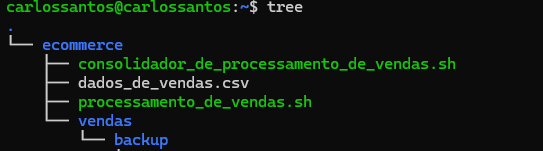
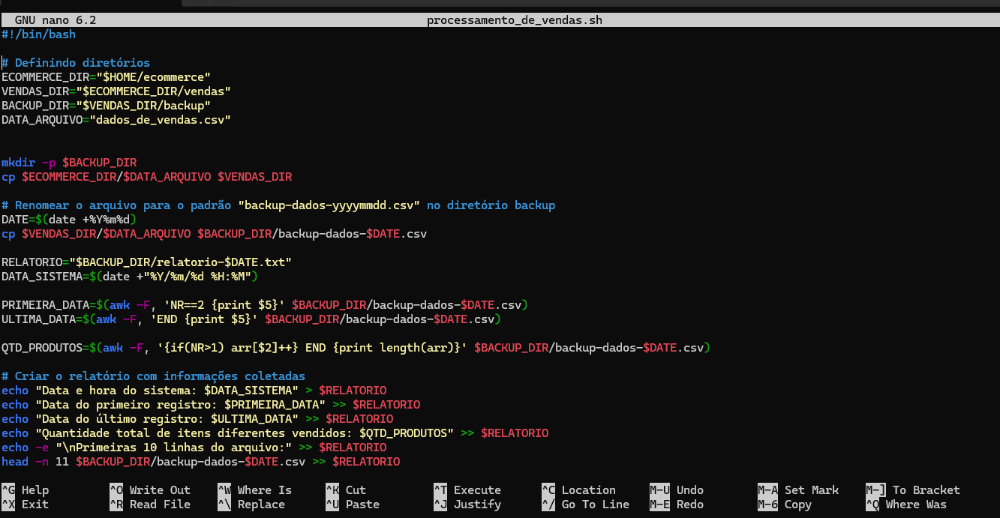

# Descrição do desafio
O desafio consistia em gerar relatórios com informações detalhadas sobre as vendas e organizar backups de forma automatizada, usando como base o arquivo `dados_de_vendas.csv`. As tarefas principais incluíam: criar dois arquivos com a extensão .sh para que fossem gerados os relatórios. O primeiro era o arquivo `processamento_de_vendas.sh` e o outro era o `consolidador_de_processamento_de_vendas.sh`. Além disso, teria que ser feito o agendamento do `processamento_de_vendas.sh` através do `crontab -e` para que houvesse 4 execuções. Agora vamos ver o passo a passo da criação dos diretórios, arquivos e executáveis:

# Descrição de cada diretório, arquivo e script que foram criados:
- `ecommerce/`: Diretório principal onde tudo será armazenado.
- `dados_de_vendas.csv`: Arquivo com informações sobre vendas no formato id, produto, quantidade, preço, data.
- `ecommerce/vendas/`: Diretório para armazenar arquivos processados.
- `backup/`: Subdiretório dentro de vendas para armazenar backups e relatórios.

## Arquivos de Script:
- `processamento_de_vendas.sh`: Script principal para processamento, backup e geração de relatórios.
- `consolidador_de_processamento_de_vendas.sh`: Script para consolidar relatórios gerados. 

Veja abaixo um print com todos os diretórios e scripts criados.

## Agora vamos ver o passo a passo para criação dos diretórios e scripts:
Primeiro, criar o diretório `ecommerce`, nele vai ser armazenado os executáveis `processamento_de_vendas.sh`, `consolidador_de_processamento_de_vendas.sh` e o arquivo `dados_de_vendas.csv`, além de também armazenar a pasta "vendas".

## Criando o 1° executável `processamento_de_vendas.sh`: 
Esse script irá processar o arquivo `dados_de_vendas.csv`, gerar relatórios e gerenciar backups. Para isso, executamos o comando "nano" no terminal Linux, escrevemos os conteúdos (códigos) e salvamos. O código adicionado faz o seguinte: 
- Cria diretórios: Organiza os arquivos em diretórios e subdiretórios (vendas e backup).
- Copia e renomeia o arquivo de vendas: Adiciona a data atual ao nome do arquivo, facilitando a identificação e o controle de versões.
- Gera um relatório: Cria um relatório (`relatorio.txt`) com:
  - Data de execução.
  - Data do primeiro e último registro de vendas.
  - Total de itens vendidos.
  - As primeiras 10 linhas do arquivo de vendas processado.
- Compacta o arquivo de backup: Para economia de espaço, o script gera um arquivo .zip.
- Remove arquivos antigos: Exclui arquivos não compactados para manter o diretório organizado.
confira a imagem:

Logo após, temos que tornar o script executável com o comando `chmod +x processamento_de_vendas.sh`.

## Em seguida, vamos criar o segundo executável: `consolidador_de_processamento_de_vendas.sh`
Esse script irá consolidar todos os relatórios gerados pelo `processamento_de_vendas.sh` em um único arquivo final chamado `relatorio_final.txt`.

Após a criação do script, temos que torná-lo executável com o comando `chmod +x consolidador_de_processamento_de_vendas.sh`. 

Com os dois executáveis criados e testados, precisamos configurar o `crontab` para automatizar o `processamento_de_dados` para ser executado durante 4 dias às 15h27. Então digitamos o comando `crontab -e` no terminal e inserimos o caminho:  27 15 * * 1-4 /home/carlossantos/ecommerce/processamento_de_vendas.sh(Este caminho é da minha máquina).

## Agora que está tudo configurado, vamos ver a árvore após a execução do segundo dia:

Veja que foram criados os dois relatórios e os dois backups corretamente.

## Agora vamos ver a árvore após o último dia de execução:

Nota-se que foram criados os quatro relatórios e, depois de executar manualmente o consolidador, gerou também o relatório final.

# Dificuldades 
Tive dificuldades no agendamento do `crontab`, pois havia passado o endereço errado do arquivo. Também enfrentei algumas outras dificuldades, como, por exemplo, não tinha o pacote zip instalado, então quando o executável rodava, retornava uma mensagem de erro, veja na imagem:

