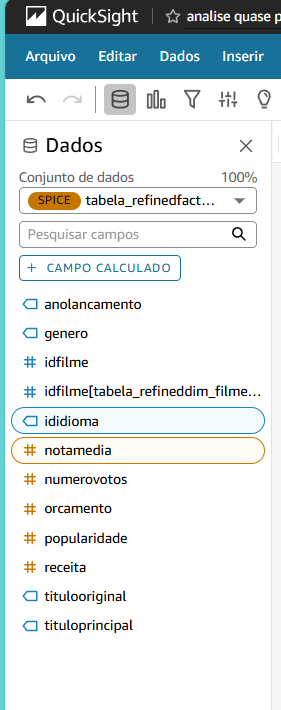

# Desafio AWS: Consumo de Dados na Camada Refined - Sprint10

## 1. Objetivo

O objetivo deste desafio é consolidar os conhecimentos adquiridos ao longo do programa, aplicando conceitos de ingestão, armazenamento, processamento e visualização de dados. O foco desta etapa é a criação de um dashboard no AWS QuickSight utilizando exclusivamente os dados da camada Refined do Data Lake.

## 2. Entregáveis

- **Código e Artefatos:**
  - Todo o código desenvolvido deve estar versionado no Git, incluindo scripts, consultas e demais artefatos organizados de forma estruturada.
- **Arquivo Markdown:**
  - Documentação detalhada do desafio, incluindo prints e explicações das etapas executadas.
- **Evidências:**
  - Imagens e prints das execuções e configurações do AWS QuickSight.
  - Capturas dos Dashboards implementados.

## 3. Preparação

Antes de iniciar, certifique-se de compreender completamente o Desafio de Filmes e Séries, cujos detalhes foram apresentados na Sprint 6.

## 4. Desafio

### 4.1. Entrega 5 - Consumo dos Dados

Nesta última etapa do desafio, o objetivo é extrair insights a partir dos dados processados no Data Lake. Até este ponto, as atividades foram voltadas à ingestão, armazenamento e processamento dos dados. Agora, a meta é criar um dashboard no **AWS QuickSight** para visualização das informações de maneira interativa.

### 4.2. Configuração e Processamento

- **Fonte de Dados:**
  - Utilizar **exclusivamente** as tabelas da camada **Refined** do Data Lake.
  - Consultas realizadas através do **AWS Athena**.

- **Construção do Dashboard:**
  - Explorar diferentes visualizações disponíveis no QuickSight.
  - Construir uma narrativa coerente com os dados disponíveis.
  
#### Configuração do QuickSight:
- **Fonte de Dados:** Athena
- **Tipo de Visualizações:** Gráficos de barras, pizza.

#### **Criação da ase de dados**

### 4.3. Resultados

A seguir, apresentamos as visualizações implementadas no dashboard:

#### **Dashboard Principal - Visão Geral**

#### **Percentual de filmes de comédia por idiomas mais frequentes**

#### **Média das notas das avaliações por Idioma dos filmes de comédia**

#### **Média dos numeros de votos por Idioma dos filmes de comédia**

#### **Média de popularidade dos filmes de comédia  por Idioma**

 

#### **Persistência dos Dados no QuikSight**

## 5. Conclusão

A construção deste dashboard permitiu consolidar o conhecimento adquirido ao longo das sprints, abordando desde a ingestão e processamento até a visualização de dados. 

- Foi utilizada a camada **Refined** para garantir informações estruturadas e otimizadas.
- O **Athena** foi empregado como intermediário para consultas eficientes.
- O **QuickSight** possibilitou a criação de um dashboard interativo e intuitivo.

Esse desafio reforça a importância de uma abordagem estruturada no gerenciamento de Data Lakes e a aplicação de boas práticas no consumo de dados para a tomada de decisões estratégicas.

