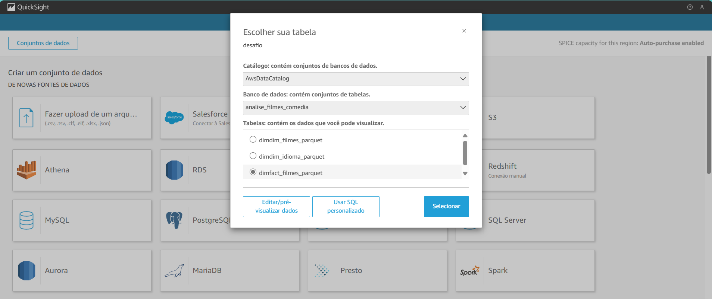

# Desafio final-AWS: Criação de Dashboards no Amazon QuickSight - Sprint10

## 1. Objetivo

O objetivo deste desafio é consolidar os conhecimentos adquiridos ao longo do programa, aplicando conceitos de ingestão, armazenamento, processamento e visualização de dados. O foco desta etapa é a criação de um dashboard no AWS QuickSight utilizando exclusivamente os dados da camada Refined do Data Lake.

## 2. Entregáveis

- **Código e Artefatos:**
  - Todo o código desenvolvido deve estar versionado no Git, incluindo scripts, consultas e demais artefatos organizados de forma estruturada.
- **Arquivo Markdown:**
  - Documentação detalhada do desafio, incluindo prints e explicações das etapas executadas.
- **Evidências:**
  - Imagens e prints das execuções e configurações do AWS QuickSight.
  - Capturas dos Dashboards implementados.

## 3. Preparação

Antes de iniciar, certifique-se de compreender completamente o Desafio de Filmes e Séries, cujos detalhes foram apresentados na Sprint 6.

## 4. Desafio

### 4.1. Entrega 5 - Consumo dos Dados

Nesta última etapa do desafio, o objetivo é extrair insights a partir dos dados processados no Data Lake. Até este ponto, as atividades foram voltadas à ingestão, armazenamento e processamento dos dados. Agora, a meta é criar um dashboard no **AWS QuickSight** para visualização das informações de maneira interativa.

### 4.2. Configuração e Processamento

- **Fonte de Dados:**
  - Utilizar **exclusivamente** as tabelas da camada **Refined** do Data Lake.
  - Consultas realizadas através do **AWS Athena**.

- **Construção do Dashboard:**
  - Explorar diferentes visualizações disponíveis no QuickSight.
  - Construir uma narrativa coerente com os dados disponíveis.
  
#### Configuração do QuickSight:
 **Criar conta no QuikSight**

**Fonte de Dados conexão com Athena:**

#### **Criação da base de dados**

### 4.3. Resultados

A seguir, apresentamos as visualizações implementadas no dashboard:

#### **Dashboard Principal - Visão Geral**

[Dashboard Principal PDF](../desafio/analise_idioma.pdf)

## **Percentual de filmes de comédia por idiomas mais frequentes**

O primeiro gráfico apresenta a distribuição percentual da quantidade de filmes de comédia produzidos por idioma entre 2010 e 2018. Observamos que o idioma inglês (en) domina amplamente o cenário, representando 81% das produções. Em seguida, temos o espanhol (es) com 7%, o francês (fr) com 6%, e os demais idiomas com percentuais inferiores. Para manter a clareza da visualização, foram incluídos apenas os seis idiomas mais relevantes, evitando que a exibição ficasse sobrecarregada com idiomas de participação muito pequena.

## **Média das notas das avaliações por Idioma dos filmes de comédia**

Ao analisarmos a média das avaliações dos filmes de comédia por idioma, notamos um cenário interessante. O idioma mais bem avaliado é o bs (8.8), seguido por sq (8.5), ja (7.57), ko (7.5), si (7.5), sv (7.5), lb (7.4), mr (7.4), pa (7.4), en (7.32), fr (6.73), it (6.68), pt (6.66), ml (6.63), de (6.60), hi (6.5) e da(6.3). Esse resultado sugere que, mesmo em idiomas com baixa frequência de produção, os filmes podem alcançar ótimas avaliações. Contudo, essa média pode ser influenciada pela quantidade de votos recebidos, tornando necessário um olhar mais detalhado sobre esse aspecto.

## **Média dos numeros de votos por Idioma dos filmes de comédia**

Para entender melhor a relação entre avaliações e volume de interações, analisamos o número médio de votos que os filmes de cada idioma receberam. Os dados mostram que os filmes em inglês (en) possuem uma média de 17.398 votos, muito superior a qualquer outro idioma. Em comparação, o bs, que lidera as avaliações, tem apenas 30 votos em média, uma quantidade muito inferior. Outros idiomas como francês (9546.5), italiano (5949.2) e hindi (5271.7) também apresentam números expressivos, mas ainda assim bem abaixo do idioma predominante.
Essa discrepância evidencia que a quantidade de votos tem um impacto direto na média das avaliações. Idiomas com poucos votos podem ter suas médias menos representativas e mais suscetíveis a variações extremas, enquanto idiomas com maior volume de votos tendem a exibir uma avaliação mais homogênea e consistente.

## **Média de popularidade dos filmes de comédia  por Idioma**

Analisando a popularidade dos filmes de comédia por idioma. O idioma inglês (en) novamente lidera, com um índice de 13.32, seguido por japonês (ja) com 13.18 e espanhol (es) com 13.15. Outros idiomas apresentam popularidade bem menor, com destaque para fr (9), bn (8.20) e no (6.74). Já idiomas como bs (0.25) e si (0.24) apresentam baixa popularidade, o que pode explicar a quantidade reduzida de votos recebidos por filmes nesses idiomas.

 

## 5. Conclusão

A partir dessa análise, percebemos que o idioma inglês domina a produção e popularidade dos filmes de comédia, sendo também o que recebe mais votos. No entanto, filmes em idiomas menos frequentes podem obter avaliações elevadas, mas isso pode estar diretamente relacionado ao baixo número de votos, tornando essas médias menos confiáveis. Esse conjunto de fatores deve ser levado em consideração ao interpretar os resultados, destacando que a relação entre produção, avaliação e popularidade envolve múltiplos fatores, incluindo a exposição dos filmes e o engajamento do público.

