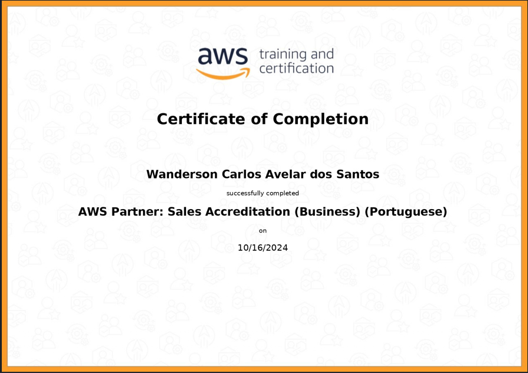

## Sprint 2 (SQL & AWS) - Trilha de Data Engineering

### Introdução

Nesta segunda sprint da trilha de Data Engineering, nos aprofundamos em conceitos fundamentais de SQL. O objetivo foi fornecer uma base sólida para o uso de ferramentas e comandos essenciais no ambiente de desenvolvimento.

## Aprendizados

### SQL
**Comandos Básicos e avançados**: tivemos a oportunidade de aprender a criar, deletar, alterar e mantipular tabelas.

**Modelagem de dados**: Aprendi a como modelar dados, criar tabelas relacionais e dimencionais, criar views, de uma forma geral, obtive muito conhecimento sobre relação de tabelas e da modelagem em si. 

### AWS

 Aprendi os conceitos fundamentais de computação em nuvem, como a entrega de recursos de TI sob demanda e a escalabilidade dos serviços. Compreendi os modelos de implantação, como SaaS, PaaS e IaaS, e os benefícios de utilizar a AWS, que incluem redução de custos, produtividade da equipe e resiliência operacional. Além disso, explorei a vasta gama de serviços oferecidos pela AWS, como computação, armazenamento e segurança, bem como a importância da inovação e da sustentabilidade no uso da nuvem.

## Desafio 
Enfrentamos o desafio de normalizar uma base de dados e criar um modelo dimensional com base no arquivo fornecido concessionaria.zip. As tarefas principais incluíam: aplicar as Formas Normais nas tabelas para eliminar redundâncias e organizar os dados de forma eficiente. Após a normalização, era necessário converter o modelo relacional em um Modelo Dimensional, com a criação de uma tabela de fato e tabelas de dimensões. Além disso, seria preciso criar views para facilitar a consulta e análise dos dados. Agora vamos ver o passo a passo da criação das tabelas, relações e views.(conferir a pasta desafios dentro desse repositório)[ Desafio](../sprint_2/desafio/)
.

## Exercicios 

### Nesta segunda sprint realizamo varios exercicios para fixação dos conceitos da linguagem SQL. De 1 a 7 os exercicios foram referentes a uma base de uma biblioteca, onde o conheciomento foi testado com comandos essencial para o aprendizado da linguagem:

Veja a lista de exercicios:

[ exercicio_1](../sprint_2/exercicios/ex_1.sql)

[ exercicio_2](../sprint_2/exercicios/ex_2.sql)

[ exercicio_3](../sprint_2/exercicios/ex_3.sql)

[ exercicio_4](../sprint_2/exercicios/ex_4.sql)

[ exercicio_5](../sprint_2/exercicios/ex_5.sql)

[ exercicio_6](../sprint_2/exercicios/ex_6.sql)

[ exercicio_7](../sprint_2/exercicios/ex_7.sql)

### OS exercicios de 8 a 16 foram referentes a uma Loja.

Veja a lista de exercicios abaixo:

[ exercicio_8](../sprint_2/exercicios/ex_8.sql)

[ exercicio_9](../sprint_2/exercicios/ex_9.sql)

[ exercicio_10](../sprint_2/exercicios/ex_10.sql)

[ exercicio_11](../sprint_2/exercicios/ex_11.sql)

[ exercicio_12](../sprint_2/exercicios/ex_12.sql)

[ exercicio_13](../sprint_2/exercicios/ex_13.sql)

[ exercicio_14](../sprint_2/exercicios/ex_14.sql)

[ exercicio_15](../sprint_2/exercicios/ex_15.sql)

[ exercicio_16](../sprint_2/exercicios/ex_16.sql)

 Foi solicitado também o exercício de Extrair e exportar dados em formato CSV da base de dados "Biblioteca". A primeira parte envolve a exportação dos 10 livros mais caros em formato CSV, com separador ponto e vírgula (;), incluindo as colunas: CodLivro, Titulo, CodAutor, NomeAutor, Valor, CodEditora, e NomeEditora.

[ livros mais caros](../sprint_2/exercicios/Livros_mais_caros.csv)

  A segunda parte solicita a exportação das 5 editoras com maior quantidade de livros, em formato CSV com separador pipe (|), contendo as colunas: CodEditora, NomeEditora e QuantidadeLivros.

  [Editora com maior quantidade de livros](../sprint_2/exercicios/Editoras_maior_quantidade_livro.csv)
 
## Certificados 
Na segunda sprint obtive o certificado AWS PARTNER: SALES ACCREDITATION (BUSINESS) (PORTUGUESE)

## Conclusão

Esta sprint foi crucial para desenvolver habilidades que serão fundamentais em projetos futuros na carreira de dados. Além da compreensão das regras de negocios e vendas da AWS.