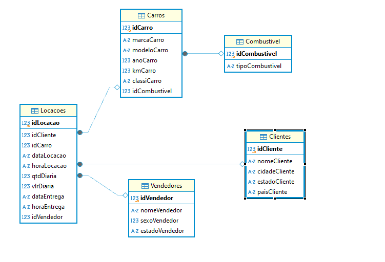
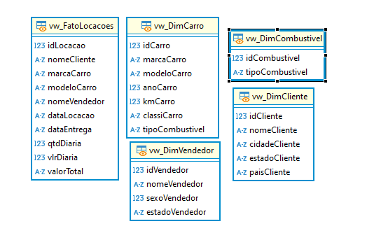

# Descrição do dessafio
O desafio consistia em normalizar a base de dados e criar um modelo dimensional com base no arquivo fornecido concessionaria.zip. As tarefas principais incluíam: aplicar as Formas Normais nas tabelas para eliminar redundâncias e organizar os dados de forma eficiente. Após a normalização, era necessário converter o modelo relacional em um Modelo Dimensional, com a criação de uma tabela de fato e tabelas de dimensões. Além disso, seria preciso criar views para facilitar a consulta e análise dos dados. Agora vamos ver o passo a passo da criação das tabelas, relações e views.

# Passo a passo Para a normalização

### 1. Primeira Forma Normal :
Remoção de grupos repetidos: Garantimos que cada tabela possui colunas atômicas, ou seja, sem múltiplos valores em um único campo.
Tabela Clientes: Cada cliente tem uma única linha com seus atributos individuais.
Tabela Carros: Cada carro possui seus detalhes únicos (marca, modelo, combustível).
### 2. Segunda Forma Normal :
Eliminação de dependências parciais: As tabelas foram organizadas para que cada coluna não-chave dependa inteiramente da chave primária.
Tabela Locacoes: Garantimos que todas as colunas (ex: cliente, carro, vendedor) dependem totalmente da chave primária idLocacao.
### 3. Terceira Forma Normal :
Eliminação de dependências transitivas: A tabela foi reorganizada para remover dependências entre colunas não-chave.
Tabela Carros: Separação da informação sobre o combustível em uma tabela distinta Combustivel, removendo redundâncias.

# veja a imagem da modelagem relacional após a normalização da base de dados

# Logo após a criação do modelo relacional foram criadas as tabelas fato e dimencionais, além de serem criadas views:

### Tabelas dimencionais:
As tabelas de dimensões descrevem os elementos de cada evento (clientes, carros, vendedores, combustível) e as tabela de fato centraliza os eventos de negócios, que no caso vai ser a locação de carros, como pode ser visto na imagem abaixo:

## Views
As views foram criadas para facilitar a consulta dos dados das tabelas dimencionais,
Nesse caso foi criada uma view para cada tabela dimencional, para ficar mais claro veja uma imagem das views criadas:

