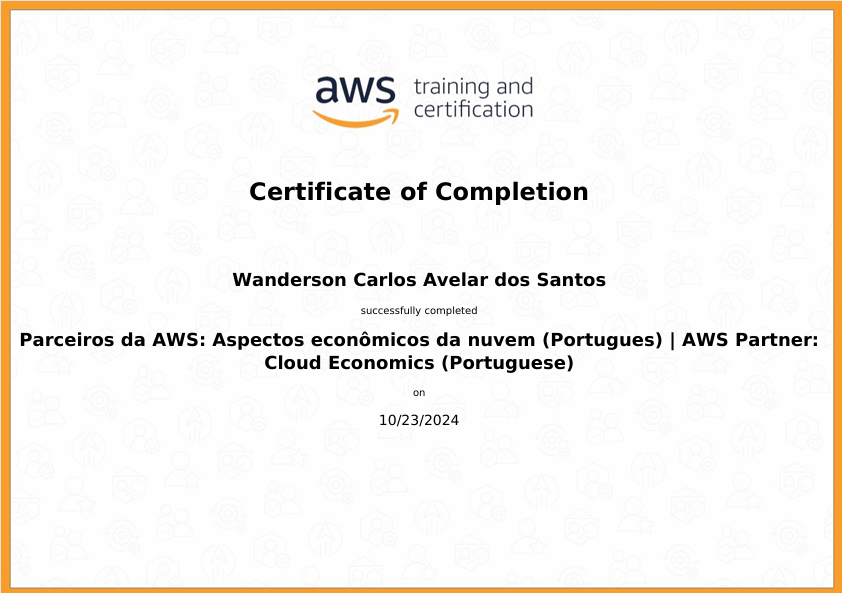

## Sprint 3 (PYTHON) - Trilha de Data Engineering

### Introdução

Nesta terceira sprint da trilha de Data Engineering, nos aprofundamos em conceitos fundamentais de python do basico ao avançado. O objetivo foi fornecer uma base sólida para o uso de ferramentas e comandos essenciais no ambiente de desenvolvimento.

## Aprendizados

### python
**Comandos Básicos e avançados**: tivemos a oportunidade de aprender a criar e manipular listas,  dicionários, conjuntos, etc. Além disso, aprendemos a trabalhar com com classes, objetos , métodos e atributos. tabem aprendemos a trabalhar com manipulaçaõ de arquivos, incluindo leitura e escrita de arquivos.

### AWS

 Neste conteúdo da AWS, aprendi sobre os fundamentos da Economia da Nuvem , que aborda o valor dos negócios e a gestão financeira da nuvem. Uma análise do Custo Total de Propriedade (TCO) é essencial para mostrar os benefícios econômicos da migração em comparação com a TI local. O Cloud Value Framework destaca pilares como economia de custos, produtividade da equipe, resiliência operacional, agilidade de negócios e sustentabilidade.

## Desafio 
Enfrentamos o desafio de analisar uma base de dados da Google Play Store fornecida no arquivo googleplaystore.csv, aplicando conhecimentos de Python e visualização de dados. As principais tarefas incluíam a limpeza e manipulação dos dados, bem como a criação de gráficos e métricas analíticas para facilitar a interpretação do dataset.[📁Desafio](../sprint_3/desafio/)

## Exercicios 

# Seção 3: Linguagem python I - 1/2

### Nesta segunda sprint realizamo varios exercicios para fixação dos conceitos da linguagem PYTHON. De 1 a 5 os exercicios foram referentes a conceitos mais basicos, onde o conheciomento foi testado com comandos essencial para o aprendizado da linguagem:

Veja a lista de exercicios:

[ exercicio_1](../sprint_3/exercicios/ex_1.py)

[ exercicio_2](../sprint_3/exercicios/ex_2.py)

[ exercicio_3](../sprint_3/exercicios/ex_3.py)

[ exercicio_4](../sprint_3/exercicios/ex_4.py)

[ exercicio_5](../sprint_3/exercicios/ex_5.py)

# Seção 4: Linguagem python I - 1/3

### Exercicios de 6 a 25 foram vistos comandos mais complexos como manipulação de arquivos, trabalhar com classes, objetos, métodos e atributos, etc.

Veja a lista de exercicios abaixo:

[ exercicio_6](../sprint_3/exercicios/ex_6.py)

[ exercicio_7](../sprint_3/exercicios/ex_7.py)

[ exercicio_8](../sprint_3/exercicios/ex_8.py)

[ exercicio_9](../sprint_3/exercicios/ex_9.py)

[ exercicio_10](../sprint_3/exercicios/ex_10.py)

[ exercicio_11](../sprint_3/exercicios/ex_11.py)

[ exercicio_12](../sprint_3/exercicios/ex_12.py)

[ exercicio_13](../sprint_3/exercicios/ex_13.py)

[ exercicio_14](../sprint_3/exercicios/ex_14.py)

[ exercicio_15](../sprint_3/exercicios/ex_15.py)

[ exercicio_16](../sprint_3/exercicios/ex_16.py)

[ exercicio_17](../sprint_3/exercicios/ex_17.py)

[ exercicio_18](../sprint_3/exercicios/ex_18.py)

[ exercicio_19](../sprint_3/exercicios/ex_19.py)

[ exercicio_20](../sprint_3/exercicios/ex_20.py)

[ exercicio_21](../sprint_3/exercicios/ex_21.py)

[ exercicio_22](../sprint_3/exercicios/ex_22.py)

[ exercicio_23](../sprint_3/exercicios/ex_23.py)

[ exercicio_24](../sprint_3/exercicios/ex_24.py)

[ exercicio_25](../sprint_3/exercicios/ex_25.py)

# Seção 5: Linguagem python II

## exercicio II

 Foi solicitado também o exercício que tem como objetivo praticar o conhecimento em ETL com Python, abordando desde conceitos básicos até intermediários. O desafio consiste em processar dados do arquivo atores.csvusando apenas recursos nativos de Python, sem bibliotecas como Pandas ou NumPy. As tarefas envolvem encontrar o ator com mais, calcular a média de bilheteria dos principais filmes, identificar o ator com a maior média por filme, contar aparições dos filmes de maior bilheteria e listar os atores por receita total. As respostas deverão ser salvas em arquivos de texto nomeados de etapa-1.txt a etapa-5.txt, mantendo o arquivo atores.csv inalterado.

Arquivo txt: [Etapa-1.txt](../sprint_3/exercicios/ETL_actors/etapa-1.txt)

Arquivo txt: [Etapa-2.txt](../sprint_3/exercicios/ETL_actors/etapa-2.txt)

Arquivo txt: [Etapa-3.txt](../sprint_3/exercicios/ETL_actors/etapa-3.txt)

Arquivo txt: [Etapa-4.txt](../sprint_3/exercicios/ETL_actors/etapa-4.txt)

Arquivo txt: [Etapa-5.txt](../sprint_3/exercicios/ETL_actors/etapa-5.txt)

### Scripts python usados para fazer a manipulação do arquivo:

Codigo em python: [Etapa-1.py](../sprint_3/exercicios/ETL_actors/etapa-1.py)

Codigo em python: [Etapa-2.py](../sprint_3/exercicios/ETL_actors/etapa-2.py)

Codigo em python:  [Etapa-3.py](../sprint_3/exercicios/ETL_actors/etapa-3.py)

Codigo em python:  [Etapa-4.py](../sprint_3/exercicios/ETL_actors/etapa-4.py)

Codigo em python:[Etapa-5.py](../sprint_3/exercicios/ETL_actors/etapa-5.py)

 
## Certificados 
Na segunda sprint obtive o certificado  AWS: Aspectos econômicos da nuvem (Portugues) | AWS Partner: Cloud Economics (Portuguese)

## Conclusão

Esta sprint foi crucial para desenvolver habilidades que serão fundamentais em projetos futuros na carreira de dados. Além da compreensão das regras de negocios e vendas da AWS.