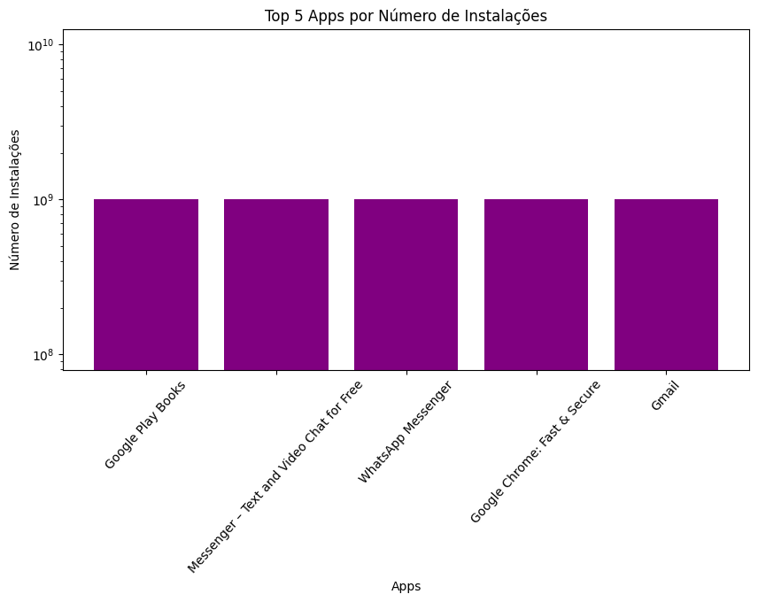

# Descrição do Desafio

O desafio proposto envolve a prática de programação em Python, com foco na análise de dados, utilizando o arquivo `googleplaystore.csv`, que contém informações sobre aplicativos disponíveis na Google Play Store. Este projeto visa integrar e aplicar conceitos fundamentais aprendidos durante o curso de Programação Básicas e avançadas em python, como manipulação de dados, visualização gráfica e documentação de código.
O principal objetivo é desenvolver habilidades na programação com a linguagem python, utilizando as bibliotecas **Pandas** para manipulação e limpeza de dados, e **Matplotlib** para visualização gráfica. 

## 2. Entregáveis

- Arquivo no formato `.IPYNB` contendo o código no modelo de Notebook.
[Desafio_googleplay.ipynb](../desafio/desafio_google_play_Store/desafio_googleplay.ipynb)
  
  

## 4. Desafio

O objetivo é ler o arquivo de estatísticas da Loja do Google googleplaystore.csv para análise. Para isso, segui as seguintes etapas:

### 4.1. Etapa 1: Ambiente

Para iniciar eu instalei as as bibliotecas **Pandas** e **Matplotlib** 

### 4.2. Etapa 2: Desenvolvimento

### 1. Fiz a leitura do arquivo CSV `googleplaystore.csv` para realizar as atividades sobre o dataset utilizando as bibliotecas **Pandas** e **Matplotlib**:
   - Remover as linhas duplicadas.
   
### 2. Fazer um gráfico de barras contendo os **top 5 apps** por número de instalações.

### 3. Fazer um gráfico de pizza (pie chart) mostrando as categorias de apps existentes no dataset de acordo com a frequência em que elas aparecem.

### 4. Mostrar qual o app mais caro existente no dataset.
`O App mais caro é "I'm Rich - Trump Edition", com o preço 400.00`

### 5. Mostrar quantos apps são classificados como **'Mature 17+'**.
`a quantidade de filmes +17 é:  447`

### 6. Mostrar o **top 10 apps** por número de reviews, bem como o respectivo número de reviews. Ordene a lista de forma decrescente por número de reviews.

### 7. Criar pelo menos mais 2 cálculos sobre o dataset e apresente um em formato de lista e outro em formato de valor.

### 1º Calculo:  a média de instalações de 5 maiores categorias

### 2º Calculo: A Média geral de instalações de todos os aplicativos:

`A média geral de instalações de todos os aplicativos é de: 14157759.44`

### 8. Criar pelo menos outras 2 formas gráficas de exibição dos indicadores acima utilizando a biblioteca **Matplotlib**. 
O primeiro foi um grafico de linhas para categorias com maior média de instalações:

### O segundo de dispersão  para mostrar a relação entre  o número de reviews e instalação.

---

## Conclusão

Ao final do desafio, Pude obter uma compreensão mais profunda da manipulação de dados e visualização em Python, além de ficar mais familiarizado com as bibliotecas **Pandas** e **Matplotlib**.

