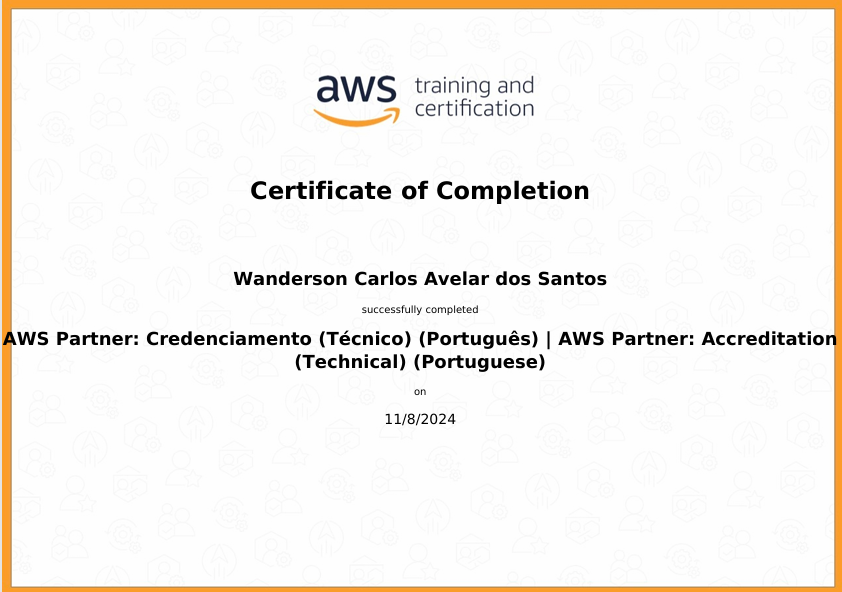

# Sprint 4 (DOCKER) - Trilha de Data Engineering

### Introdução

Nesta quarta sprint da trilha de Data Engineering, exploramos o uso de Docker, uma ferramenta essencial para a criação e gestão de ambientes isolados. O objetivo foi compreender como os containers funcionam e desenvolver práticas para a construção, execução e reutilização de containers, aprimorando o fluxo de trabalho com Python em ambientes conteinerizados. Além disso, aprofundamos nosso conhecimento em conceitos de segurança e desempenho de containers, preparando-nos para demandas reais de projetos de engenharia de dados.

## Aprendizados

### Docker
**Containers e Imagens Docker**: Aprendemos a criar imagens Docker personalizadas e configurar ambientes de desenvolvimento usando Dockerfiles. Exploramos comandos como `docker build`, `docker run` e `docker-compose`, entendendo como gerenciar containers, volumes e redes. Adquirimos também uma compreensão básica sobre a reutilização de containers e o gerenciamento de dependências entre eles.

**Desafios com Containers Reutilizáveis**: Utilizando o Docker, realizamos práticas de desenvolvimento onde criamos scripts Python dentro de containers.

### Python
**Programação funcional**: No contexto dos exercícios desta sprint, realizamos práticas em Python para entender a interação com o Docker e aprimorar scripts que facilitam operações com uso de funções como lambda, map, filter, sorted e sum para serem usadas na análise de dados e hashing de strings.

### AWS

Aprendi fundamentos da AWS, incluindo o uso do Console de Gerenciamento, e como aplicar o AWS Cloud Adoption Framework (CAF) para planejar e otimizar a migração para a nuvem. Explorei estratégias de migração, como realocar e refatorar, para diferentes cenários e necessidades. Também estudei o AWS Well-Architected Framework, que promove arquiteturas seguras, eficientes e sustentáveis, ajudando a alinhar soluções aos objetivos de negócios.

## Desafio

O desafio principal desta sprint foi desenvolver uma imagem Docker a partir de um arquivo Dockerfile e executar containers com scripts Python que geram hashes de strings usando SHA-1. Este desafio nos ajudou a consolidar o conhecimento sobre a criação e a reutilização de containers Docker, além de aplicar princípios de segurança e integridade de dados.

### Tarefas do Desafio:

1. **Construção de Imagem Docker**: Criação de um Dockerfile personalizado que define um ambiente Python minimalista, com as dependências necessárias para rodar o script de hashing.
   
2. **Execução de Containers**: Configuração de um container a partir da imagem Docker para rodar scripts que realizam operações de hash utilizando SHA-1, exemplificando práticas de segurança e imutabilidade dos dados.

3. **Reutilização de Containers**: Implementação de práticas que permitiram a reutilização dos containers, otimizando o processo de desenvolvimento e reduzindo o tempo de build para execuções subsequentes.

4. **Script de Hashing com Python**: Desenvolvimento de um script Python que, executado no container, gera o hash de strings usando o algoritmo SHA-1, assegurando consistência nos resultados e melhorando a segurança na manipulação dos dados.

## Exercícios

Para consolidar os conceitos estudados, realizamos sete exercícios de Python (funcional), onde cada exercício exigiu a aplicação prática das funcionalidades aprendidas.

Veja a lista dos exercícios:

- [Exercício 1](../sprint_4/exercicios/ex_1.py)
- [Exercício 2](../sprint_4/exercicios/ex_2.py)
- [Exercício 3](../sprint_4/exercicios/ex_3.py)
- [Exercício 4](../sprint_4/exercicios/ex_4.py)
- [Exercício 5](../sprint_4/exercicios/ex_5.py)
- [Exercício 6](../sprint_4/exercicios/ex_6.py)
- [Exercício 7](../sprint_4/exercicios/ex_7.py)

## Certificados

Nesta sprint, obtemos um certificado adicional AWS Partner: Credenciamento (Técnico) (Português) | AWS Partner: Accreditation (Technical) (Portuguese).

## Conclusão

Esta sprint foi fundamental para o desenvolvimento de habilidades práticas com Docker e Python, essenciais para o ambiente de engenharia de dados. A experiência com containers Docker nos proporcionou uma visão mais clara sobre a importância da modularidade e da segurança na manipulação e distribuição de ambientes de desenvolvimento e produção.
