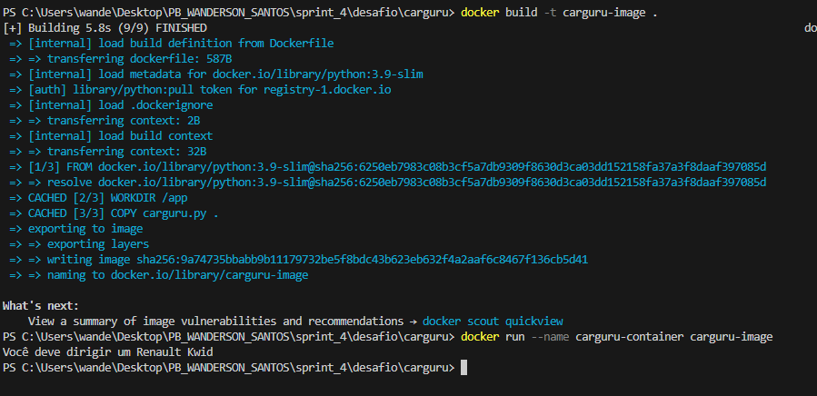
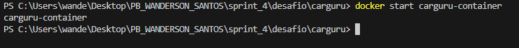
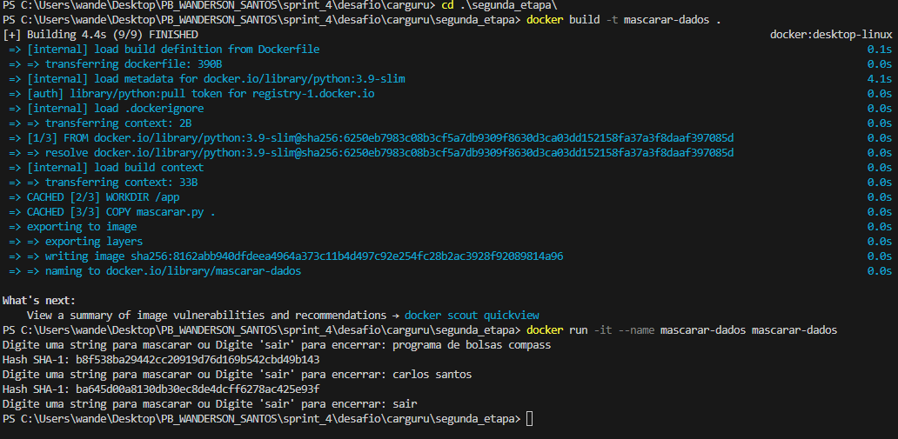

# Descrição do Desafio

Este desafio tem como objetivo a prática de Docker e Python, integrando conhecimentos para criar e gerenciar containers com scripts Python. O projeto envolve a criação de imagens Docker, a execução de containers e a implementação de um script em Python que gera hashes SHA-1 a partir de entradas do usuário.

## 2. Entregáveis

- Arquivo `Dockerfile` para a criação das imagens Docker.
- Comandos necessários para construir e executar os containers.
- Arquivo `README.md` em formato Markdown, detalhando o processo e incluindo evidências da execução.
- Imagens capturadas da execução dos containers com os scripts Python.

## 4. Desafio

Este projeto é dividido em três etapas, detalhadas a seguir:

### 4.1. Etapa 1: Construção de uma Imagem Docker

Nesta primeira etapa, construí uma imagem Docker a partir de um Dockerfile, com o objetivo de executar o script `carguru.py` dentro de um container.

#### Etapas realizadas:

1. **Criação do Dockerfile:** Um arquivo Dockerfile foi criado para definir as instruções necessárias para a criação da imagem.
[Arquivo Dockerfile](../desafio/carguru/Dockerfile)
2. **Construção da Imagem Docker:** A imagem foi criada usando o comando `docker build -t carguru-image .`
3. **Execução do Container:** Em seguida, o container foi iniciado a partir da imagem criada com o comando `docker run --name carguru-container carguru-image`.

Veja a imagem da execução abaixo:

### 4.2. Etapa 2: Reutilização de Containers

Na segunda etapa, explorei a possibilidade de reutilizar containers parados e documentei os comandos necessários para reiniciar um container.

#### Questão:
É possível reutilizar containers parados?

- **Resposta:** Sim, containers parados podem ser reutilizados. Para reiniciar um container parado, o comando necessário é `docker start carguru-container`.

veja abaixo a imagem da execução:

### 4.3. Etapa 3: Criação de um Container Interativo

A última etapa envolveu a criação de um script em Python para gerar hashes SHA-1 a partir de strings de entrada. O script foi integrado a um container Docker, possibilitando uma execução interativa.

#### Etapas realizadas:

1. **Criação do Script Python**: Um script chamado `mascarar.py` foi desenvolvido com o seguinte comportamento:
   - Recebe uma string como entrada do usuário.
   - Gera o hash SHA-1 da string e exibe o resultado usando o método `hexdigest`.
   - Retorna ao passo inicial, permitindo a entrada contínua de strings.

   veja o script que utilizei:
   [mascarar_dados.py](../desafio/carguru/segunda_etapa/mascarar.py)

2. **Criação do Dockerfile para o Script**: Um novo Dockerfile foi criado para a imagem `mascarar-dados`, configurado para executar o `mascarar.py` de forma interativa.

  confira o novo Dockerfile aqui: [dockerfile_marcarar_dados](../desafio/carguru/segunda_etapa/Dockerfile)

3. **Construção e Execução do Container**: A imagem `mascarar-dados` foi criada e executada com interação utilizando o comando `docker run -it mascarar-dados`.

Veja uma imagem da execução abaixo:

## Conclusão
Ao concluir este desafio, adquiri uma compreensão mais profunda sobre a criação e manipulação de containers Docker, além de desenvolver habilidades práticas na integração de scripts Python com Docker. Esta prática proporcionou experiência com instruções Dockerfile, conteinerização de scripts e execução interativa, fortalecendo minha capacidade de realizar projetos que envolvam automação e isolamento de ambientes.

