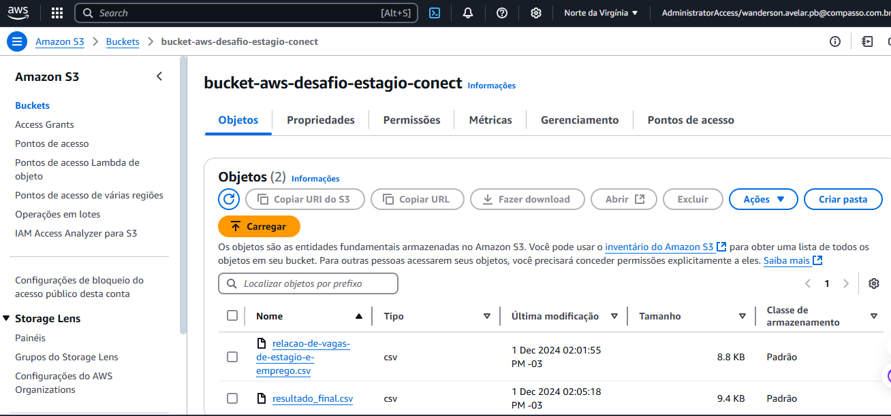

# Desafio AWS: Manipulação de Dados no S3

## 1. Objetivo

Este desafio tem como objetivo praticar conhecimentos sobre a nuvem AWS, focando na manipulação de dados armazenados no S3 por meio de scripts Python. A atividade inclui o upload, transformação e download de arquivos no bucket S3, utilizando bibliotecas como `boto3` e uma ferramentas de análise como `pandas`.

## 2. Entregáveis

- **Arquivo Markdown** contendo:
  - Documentação detalhada de cada etapa executada.
  - Evidências da execução.
- **Códigos Python (`.py`)** utilizados para execução.
- [Script_python_para_upload](../desafio/upload_para-S3.py)
- [Script_python_para_manipulacao_dados](../desafio/arquivo_final.py)
- **Arquivo CSV**:
  - Conjunto de dados original baixado do portal do governo.
  - [csv_original](../desafio/relacao-de-vagas-de-estagio-e-emprego.csv)
  - Arquivo resultante após as manipulações.
  - [csv_modificado](../desafio/resultado_final.csv)

## 4. Desafio

### 4.1. AWS S3: Manipulação de Arquivos

#### 1. Escolha e Análise do Conjunto de Dados

- Baixei um arquivo **CSV** do portal de dados públicos ([dados.gov.br](http://dados.gov.br)).
- Analisei o arquivo localmente para entender a estrutura e identificar informações úteis para as manipulações.

#### 2. Upload do Arquivo para o S3

- Criei um bucket exclusivo no S3 usando a biblioteca `boto3`.

- Utilizei o método `upload_file` para carregar o arquivo CSV para o bucket S
- Carreguei o arquivo para o bucket criado através de um script Python.
- [Script_python](../desafio/upload_para-S3.py)

#### 3. Manipulação dos Dados

A partir do arquivo armazenado no S3:

1. Ler o arquivo no formato **CSV** em um dataframe utilizando `pandas`.
2. Executar as manipulações a seguir:

   - **Cláusula de filtro** 

  Nessa função eu fiz um Filtro com dois operadores lógicos onde selecionamos vagas:
  O salário inicial é maior que R$ 1.000 & A carga horária semanal é menor que 30 horas.

   - **Duas funções de agregação** 

Função foi feita a média salarial agrupada por tipo de vagan e
Função para Somar a quantidade de candidatos agrupada por cidade.

   - **Uma função condicional** 
 Foi criada uma coluna status_salario:

Valores "Alto" para salários acima da média.

Valores "Baixo" para salários abaixo da média.

   - **Uma função de conversão**

   Foi adicionada uma nova coluna chamada salario_usd, convertendo o salário inicial de R$ para USD.

   - **Uma função de data** 

Foi extraido o ano da coluna dt_vigencia_inicio e criamos uma nova coluna chamada ano_vigencia.

   - **Uma função de string**

   Os nomes das cidades Foram transformadas todas para  letras maiúsculas

#### 4. Salvamento e Upload do Resultado

- Salvei o dataframe manipulado em um novo arquivo **CSV**.
- Faça o upload do arquivo resultante para o mesmo bucket S3 utilizando `boto3`.

---

## 5. Evidências e Organização no Git

Certifique-se de incluir os seguintes itens no repositório Git:

1. **Documentação**:
   - Markdown explicando:
     - O conjunto de dados escolhido.
     - Consultas realizadas e manipulações executadas.
     - Resultados obtidos em cada etapa.
2. **Códigos Python (`.py`)** utilizados.
3. **Arquivos CSV**:
   - Arquivo original baixado.
   - Arquivo resultante após as manipulações.
4. **Evidências de Execução**:
   - Imagens em formato `.jpeg` ou `.png`.

---

## Conclusão

Ao completar este desafio, foi possível reforçar conceitos de computação em nuvem com AWS, incluindo o uso do S3 e integração com Python para manipulação de dados. Além disso, a prática proporcionou experiência prática com bibliotecas como `boto3` e `pandas`, preparando para aplicações mais avançadas em análise e gerenciamento de dados na nuvem.
