# Lab AWS S3

## Introdução
Este laboratório tem como objetivo explorar as funcionalidades do serviço AWS S3, configurando um bucket para hospedagem de conteúdo estático. Durante as etapas, você aprenderá a criar e configurar um bucket, habilitar a hospedagem de site estático, configurar permissões e políticas de acesso público, e realizar o upload de arquivos para criar um site simples.


## Etapas e Evidências

### 1. Login no Console AWS
Acesse o AWS Management Console por meio do endereço: [academy-compass.awsapps.com/start](https://academy-compass.awsapps.com/start).  

### 2. Criar um Bucket

- Busque pelo serviço **S3** no console.
- Selecione **Create Bucket**.
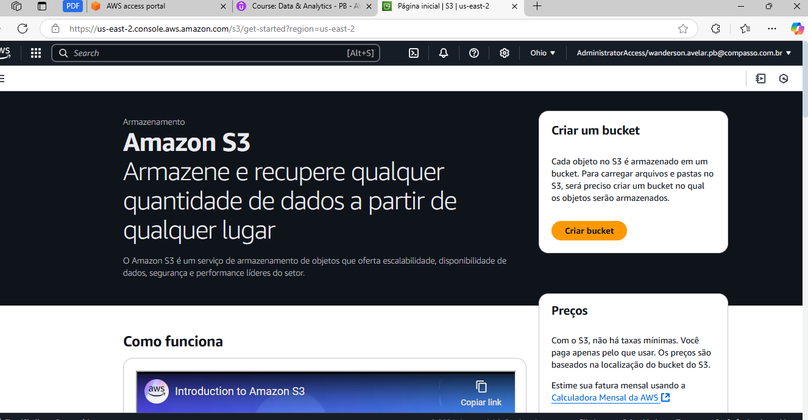

- Insira o nome do bucket (e.g., `example.com`) e escolha a região **US East (N. Virginia)**.
- Aceite as configurações padrão e crie o bucket. 

Imagem do bucket criado: 
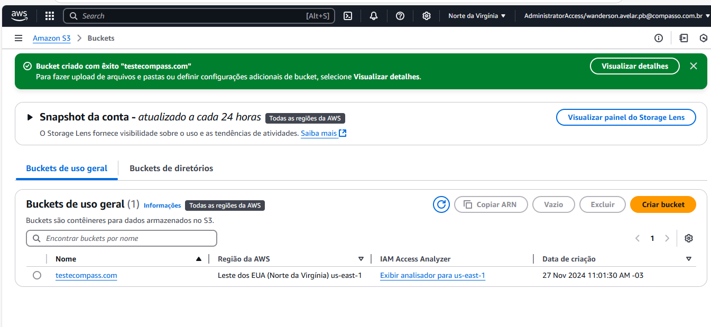


### 3. Habilitar Hospedagem de Site Estático
- Acessar o bucket criado e selecione a aba **Properties**.
- Em **Static website hosting**, habilite a opção **Use this bucket to host a website**.
- Configure o **Index Document**

**Evidência:** 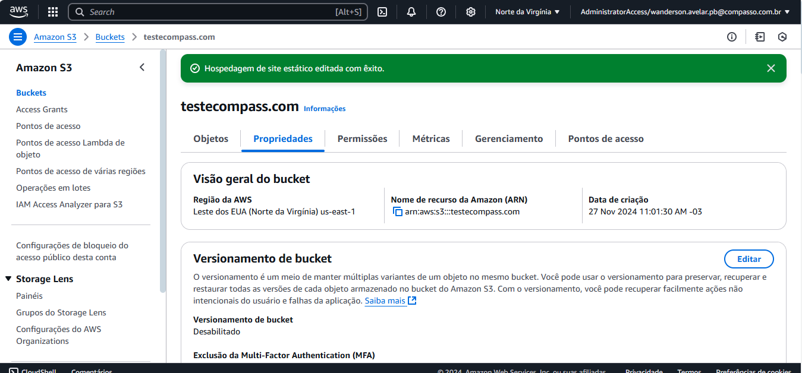


### Etapa 4: Adicionar política de bucket que torna o conteúdo do bucket publicamente disponível
- Na aba **Permissions**, edite as configurações de **Block public access**.
- Desmarque **Block all public access** e salve as alterações.  
**Evidência:** 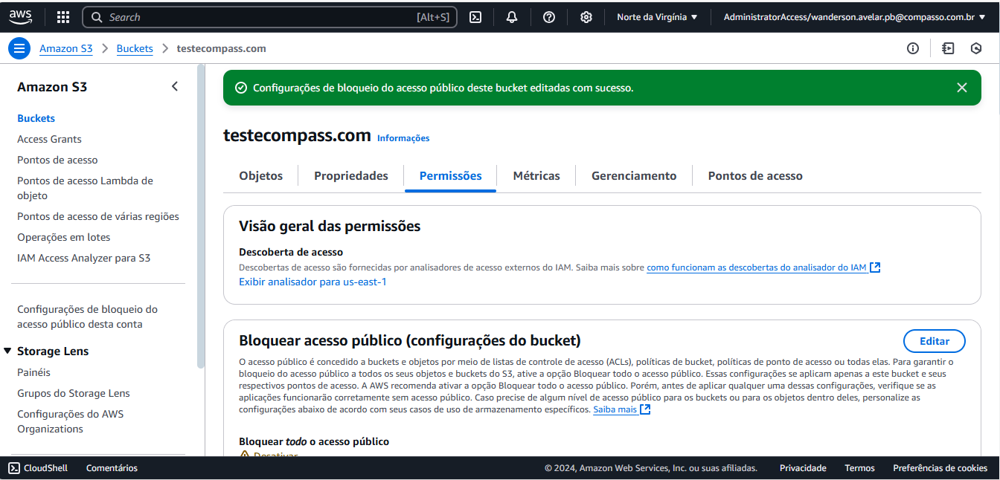


### 5. Etapa 5: Configurar um documento de índice
- Em **Permissions**, adicione a seguinte política para conceder acesso público de leitura:
  ```json
  {
      "Version": "2012-10-17",
      "Statement": [
          {
              "Sid": "PublicReadGetObject",
              "Effect": "Allow",
              "Principal": "*",
              "Action": "s3:GetObject",
              "Resource": "arn:aws:s3:::testecompass.com/*"
          }
      ]
  }

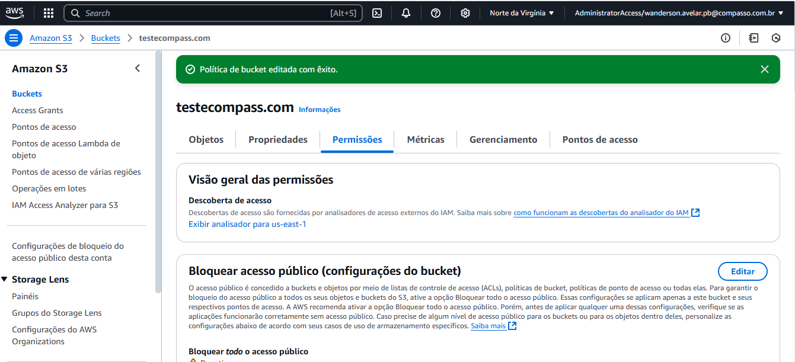

## Fazer upload do documento de indice
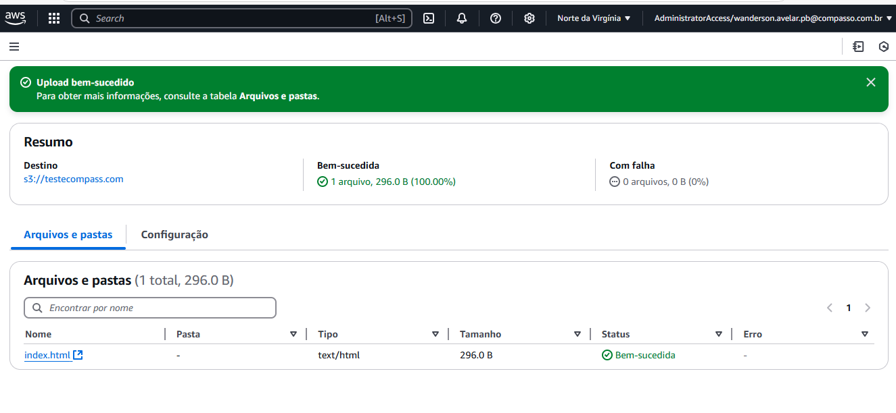

## Criar uma pasta chamada dados e, após, faça upload do conteúdo do site (arquivo CSV) para ela.
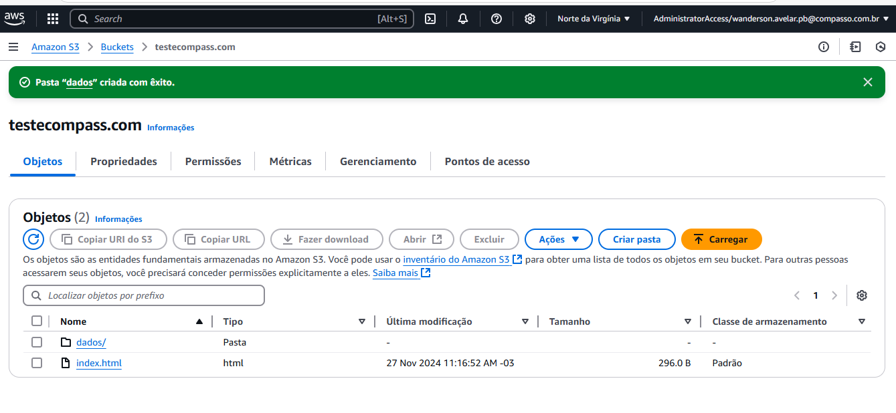

## Faça upload do conteúdo do site (arquivo CSV) para ela.
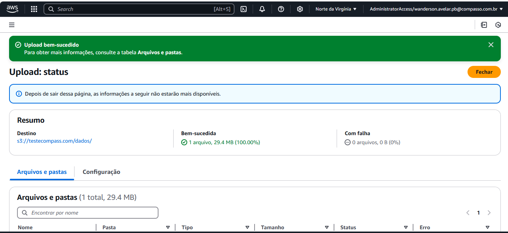

### 6. Configurar Documentos de Índice e Erros

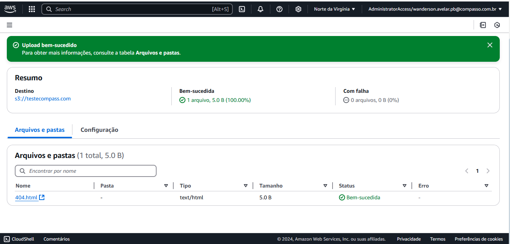

## Fazer upload do documento de erros para o bucket


### 7. Testar o Endpoint do Site

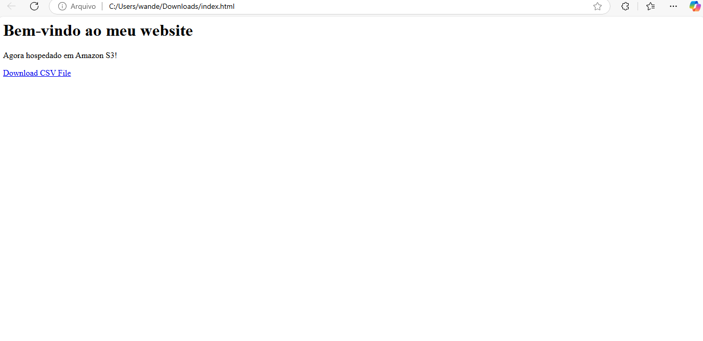

### testando o dowload do arquivo dados.csv:

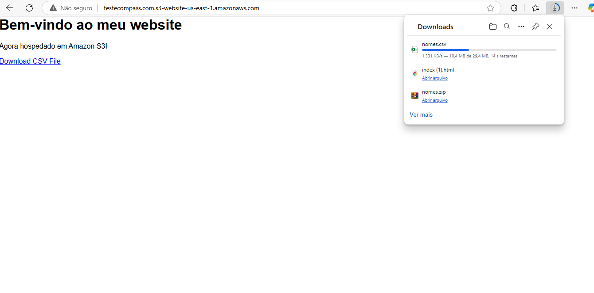

### interface com os 3 objetos criados:
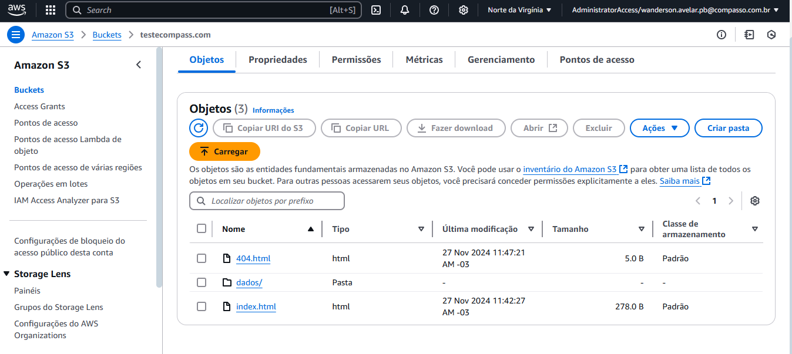