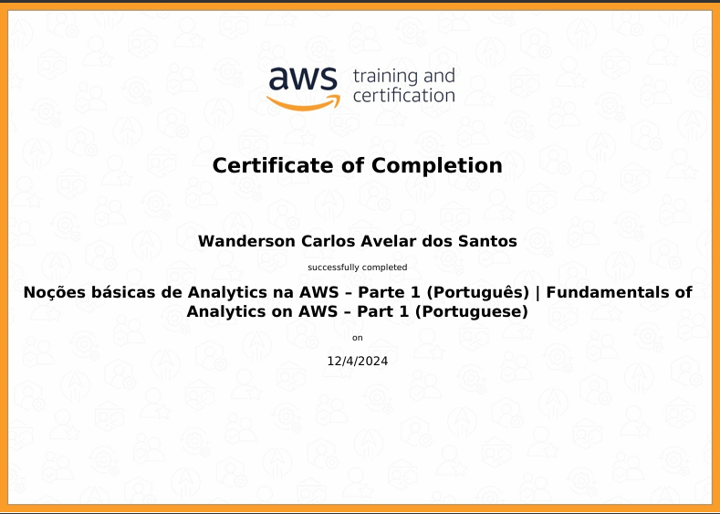
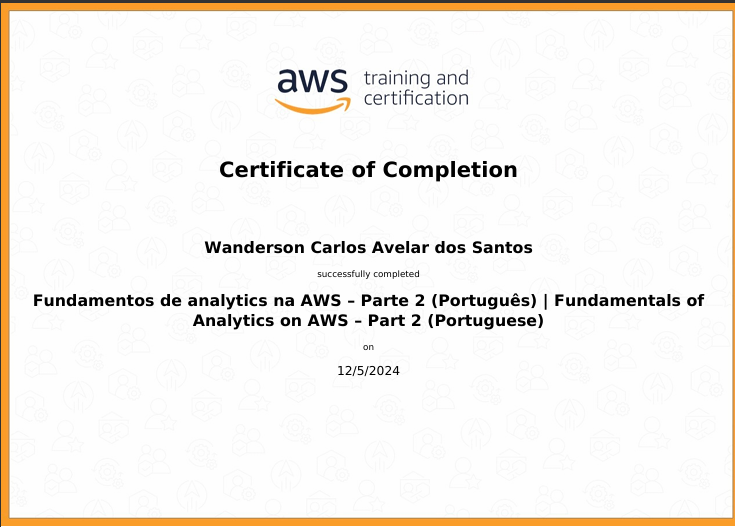
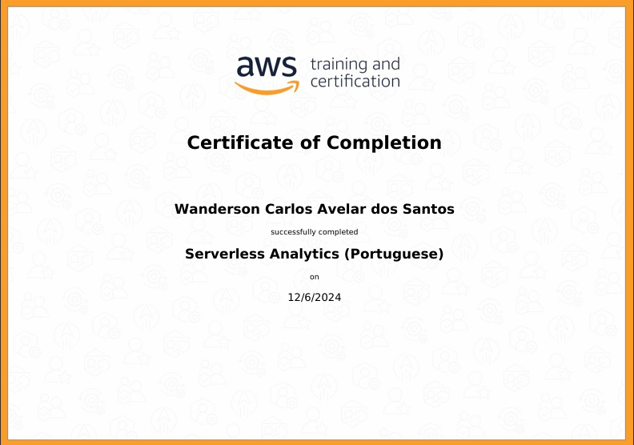
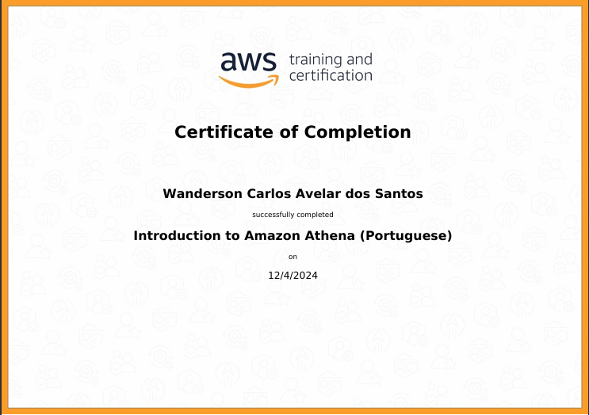
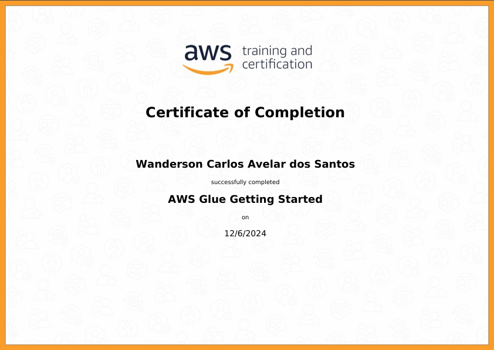
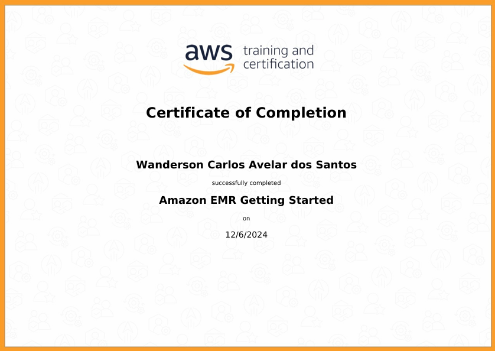
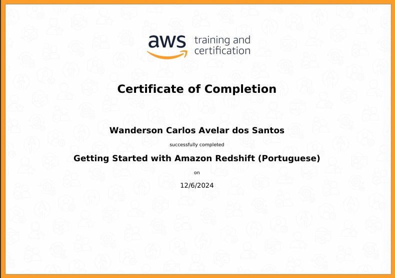
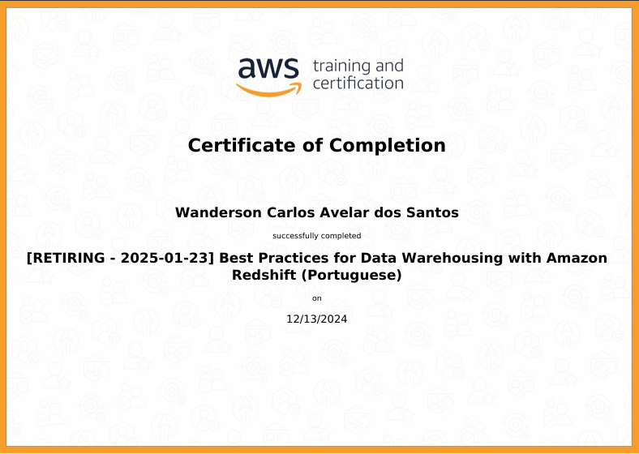

# Sprint 6 (AWS- INICIO DO DESAFIO FINAL) - Trilha de Data Engineering

### Introdução

Nesta sexta sprint da trilha de Data Engineering, exploramos os conceitos do console AWS, criamos um bucket S3, configuramos um bucket para armazenar dados, além de aprendermps sobre o AWS Glue e como criar um Data Catalog. Além disso, aprendemos a criar um Data Lake e como criar um Data Warehouse e tambem sobre lambda e como criar uma função lambda.
## Aprendizados

### AWS
 **Console AWS**: O console AWS é uma interface de usuário web que permite que os usuários gerenciem seus recursos AWS. Ele oferece uma visão geral dos recursos e permite que os usuários acessem e gerenciem recursos como instâncias EC2, bancos de dados RDS, buckets S3, etc.

 **lambda** : aprendemos a criar uma função lambda, que é uma unidade de código que pode ser executada em resposta a eventos específicos. As funções Lambda podem ser usadas para realizar tarefas como process ar dados, enviar e-mails, etc.

 **athena** : aprendemos a criar um data warehouse com a AWS Athena, que é um serviço de consultas de dados que permite que os usuários executem consultas SQL em dados armazenados em S3.

 **Glue** : aprendemos a criar um Data Catalog com o AWS Glue, que é um serviço de integração de dados que permite que os usuários criem e gerenciem catálogos de dados.
 

**Desafios envolvendo AWS, docker e python- Inicio do desafio final**: 

O desafio consiste na construção de um Data Lake para Filmes e Séries, abrangendo as etapas de ingestão, armazenamento, processamento e consumo de dados. Nesta sprint, o foco é a ingestão batch, onde será desenvolvido um código Python para carregar arquivos CSV de filmes e séries para um bucket S3 na camada RAW Zone. O processo inclui o uso da biblioteca boto3 e a execução do código em um container Docker, configurado para garantir a organização dos dados conforme o padrão especificado. O objetivo é consolidar conhecimentos práticos em Python, Docker e AWS.

- [📁Desafio](../sprint_6/desafio)

## Exercícios: 

- Exercício 1: Criar um bucket S3 e configurar para armazenar dados.

- Exercicio 2: athena: criar um data warehouse com a AWS Athena.

- Exercicio 3: lambda: criar uma função lambda para realizar uma tarefa específica.

### Confira os tres execicios abaixo:

 [📁Exercicio-1_criação_de_bucket_S3](../sprint_6/exercicios/README_exercicio.md)

  [📁Exercicio-2_Athena](../sprint_6/exercicios/README_athena.md)

   [📁Exercicio-3_Lambda](../sprint_6/exercicios/README_lambda.md)

## Certificados
Nesta sprint nos obtivemos os seguintes certificados: 

1. **AWS Skill Builder - Fundamentals of Analytics on AWS – Part 1 (Portuguese)**  
   

2. **AWS Skill Builder - Fundamentals of Analytics on AWS – Part 2 (Portuguese)**  
   

3. **AWS Skill Builder - Serverless Analytics (Portuguese)**  
   

4. **AWS Skill Builder - Introduction to Amazon Athena (Portuguese)**  
   

5. **AWS Skill Builder - AWS Glue Getting Started (English)**  
   

6. **AWS Skill Builder - Amazon EMR Getting Started (English)**  
   

7. **AWS Skill Builder - Getting Started with Amazon Redshift (Portuguese)**  
   

8. **AWS Skill Builder - Best Practices for Data Warehousing with Amazon Redshift**  
   

9. **AWS Skill Builder - Amazon QuickSight - Getting Started (English)**  
   

## Conclusão

Esta sprint foi fundamental para o desenvolvimento de habilidades práticas com Docker e Python, essenciais para o ambiente de engenharia de dados. A experiência com containers Docker nos proporcionou uma visão mais clara sobre a importância da modularidade e da segurança na manipulação e distribuição de ambientes de desenvolvimento e produção.

