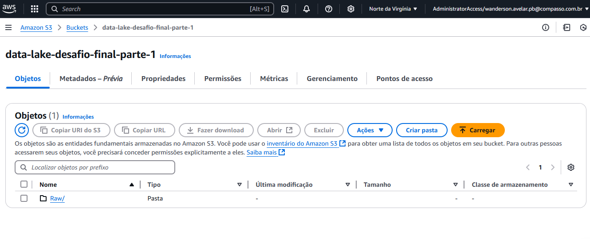
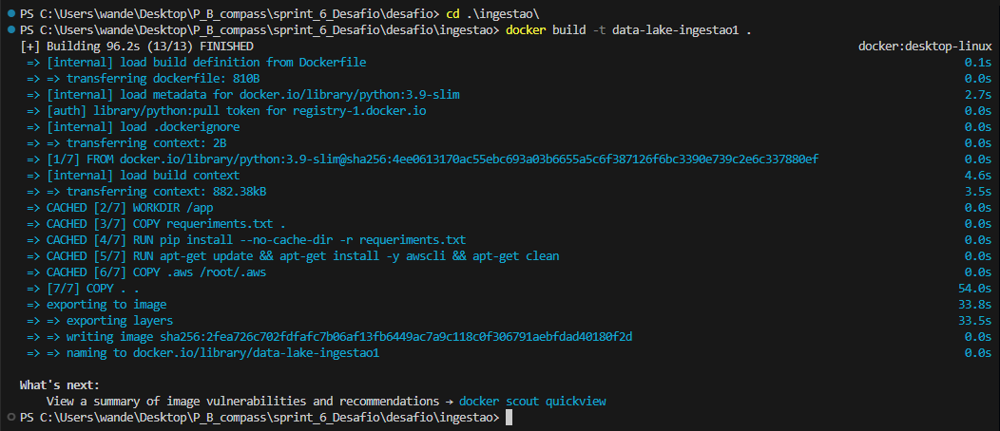
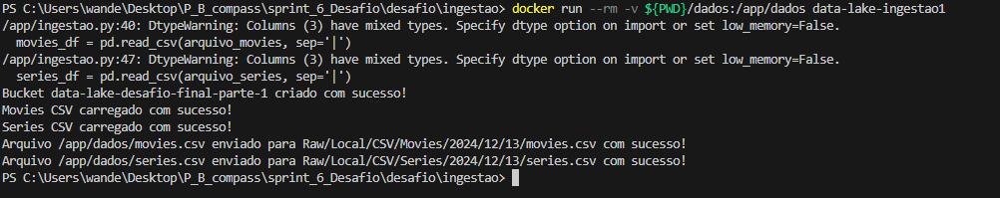
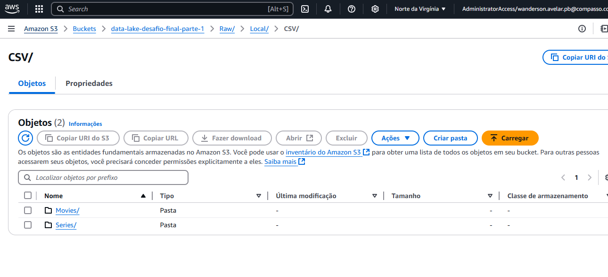
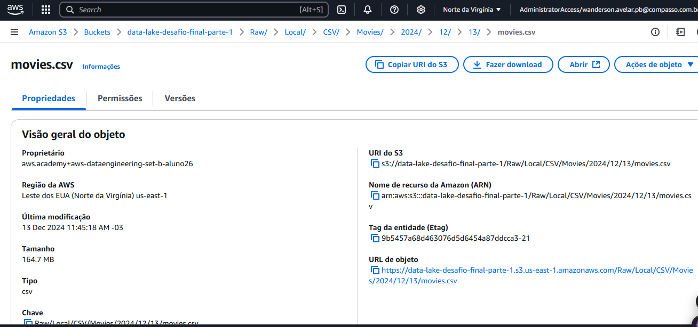
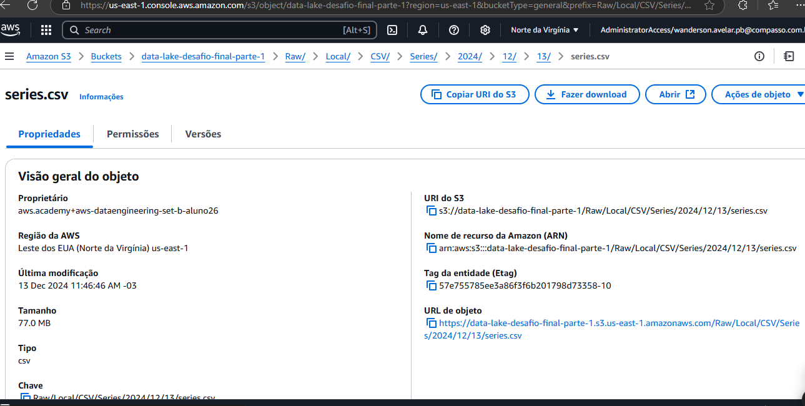

# Desafio AWS: Construção de um Data Lake para Filmes e Séries

## 1. Objetivo

Este desafio marca o início do projeto do **Desafio Final**, que consistirá na construção de um Data Lake completo. O objetivo inicial é praticar a **Ingestão Batch**, utilizando scripts Python para carregar arquivos CSV locais em um bucket S3 na AWS, como primeiro passo para implementar todas as camadas do Data Lake.

## 2. Entregáveis

- **Arquivo Markdown** contendo:
  - Documentação detalhada de cada etapa executada.
  - Evidências da execução com imagens/prints.
- **Códigos Python (`.py`)**:
  - Código de ingestão para leitura e envio dos arquivos CSV para o bucket S3.

   veja aqui o  script em python utilizado: [Script de ingestão.py](../desafio/ingestao.py)

- **Dockerfile**:
  - Configuração para criar o container Docker usado na execução do processo.

  veja aqui o Dockerfile utilizado: [Dockerfile](../desafio/Dockerfile) 
- **Imagens/prints de evidências**:
  - Configuração do bucket S3, execução do script, criação e execução do container, e arquivos enviados ao bucket.

- ## Definir suas questões que os dados devem responder:

- Quais os 10 filmes de animação/comédia tiveram as maiores bilheterias nos últimos 5 anos?

- Quais diretores  produzem os filmes de comédia/animados mais populares?

- Quais atores aparecem com mais frequência em filmes de comédia e animação?

- Os filmes de animação possuem avaliações médias maiores que os de comédia?

- Quais são os países que mais produzem filmes nos gêneros comédia e animação?

## 3. Preparação

- **Conjunto de dados**:
  - Descompactei o arquivo "Filmes e Séries.zip", contendo dois arquivos CSV: **movies.csv** e **series.csv**.
- **Configuração do ambiente AWS**:
  - Configurei credenciais no diretório `.aws` para autenticação no S3.
- **Criação do bucket S3**:
  - Bucket nomeado como `data-lake-desafio-final-parte-1` criado para armazenar os arquivos.

## 4. Desafio

### 4.1. Ingestão Batch

#### 1. Configuração do Ambiente

- Preparação dos dados para análise e envio ao bucket S3.
- Configuração inicial do bucket:
  - Estrutura organizada com subdiretórios para diferentes tipos de dados.

#### 2. Desenvolvimento do Código de Ingestão

- Desenvolvi um script Python para:
  - Ler os arquivos **movies.csv** e **series.csv**.
  - Subir os arquivos para o bucket S3, respeitando a estrutura:

    `s3://<bucket>/<camada>/<origem>/<formato>/<especificação>/<data>/arquivo.csv`

[script ingestão de dados](../desafio/ingestao.py)

#### 3. Criação e Execução do Container Docker

- Desenvolvi o **Dockerfile** configurando todas as dependências.
- Executei o container para realizar o upload dos arquivos para o S3.

### criação do container:

## Imagem de sucesso da execução local do container para fazer a carga dos dados ao S3:
  

# Bucket criado no console AWS:

 

## Print dos diretórios para onde foi feito o upload dos arquivos movies e series no S3:
  
  

  ### 4. Estrutura no S3

## Arquivos carregados no bucket com a seguinte estrutura:
  - `s3://data-lake-desafio-final-p1/Raw/Local/CSV/Movies/<ano>/<mes>/<dia>/movies.csv`

  

  - `s3://data-lake-desafio-final-p1/Raw/Local/CSV/Series/<ano>/<mes>/<dia>/series.csv`

  
  

## 5. Conclusão

Este desafio foi o primeiro passo para o **Desafio Final**, que incluirá todas as camadas de um Data Lake: Ingestão, Armazenamento, Processamento e Consumo. Durante a implementação, pratiquei:
- Uso da AWS para criação de buckets S3 e manipulação de arquivos.
- Desenvolvimento e execução de scripts Python integrados ao S3.
- Configuração de containers Docker para execução de processos.

As atividades reforçaram a importância da organização no armazenamento de dados e a automação dos processos, estabelecendo a base para os próximos passos no projeto do Data Lake.
