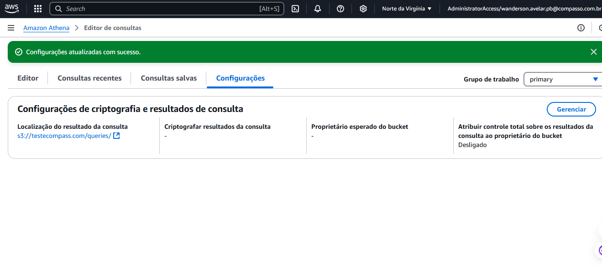
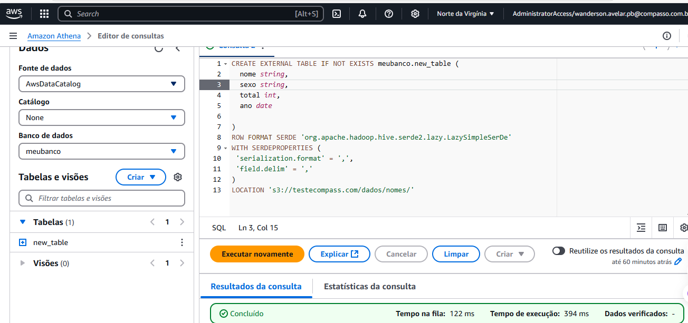
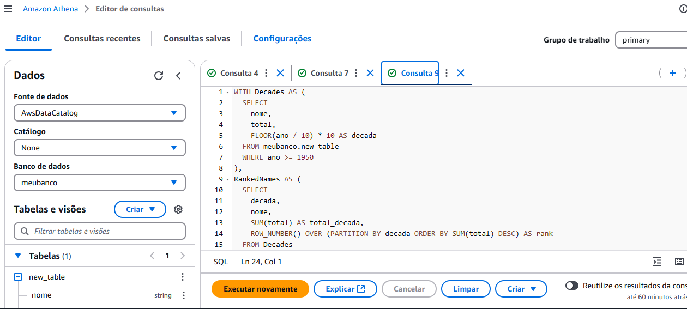
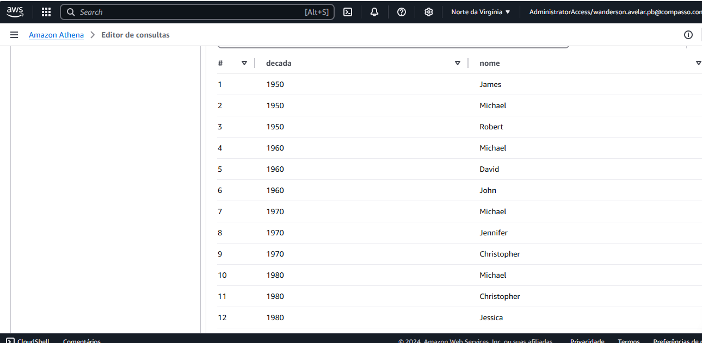

# Exercicio 2- Athena 

### Instruções para Configuração e Consulta de Banco de Dados

## Passo 1: Na guia *Settings* (Configurações), escolha *Manage* (Gerenciar).

---

## Etapa 2: Criar um banco de dados

---

## Etapa 3: Criar uma tabela

---

## Etapa 4: Teste os dados com a seguinte consulta
Substitua o nome dos campos, banco de dados e tabela pelos nomes que você criou anteriormente:
sql
SELECT nome 
FROM nomedobanco.nomedatabela 
WHERE ano = 1999 
ORDER BY total 
LIMIT 15;

## Crie uma consulta que lista os 3 nomes mais usados em cada década desde o 1950 até hoje.

## resultado

