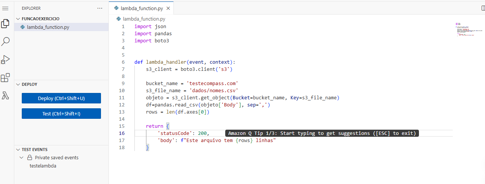
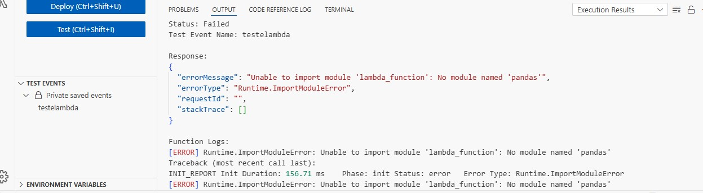
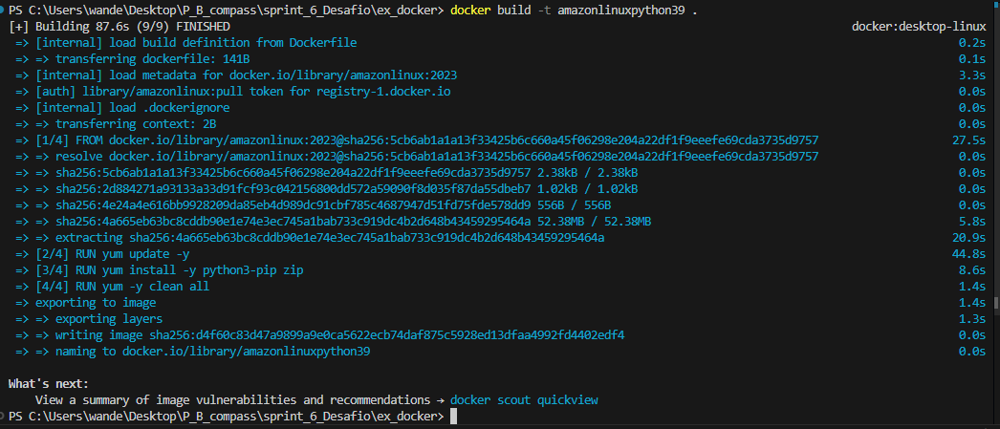
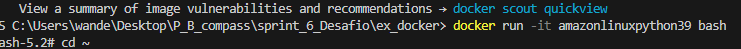
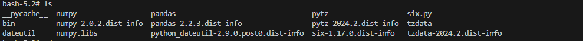
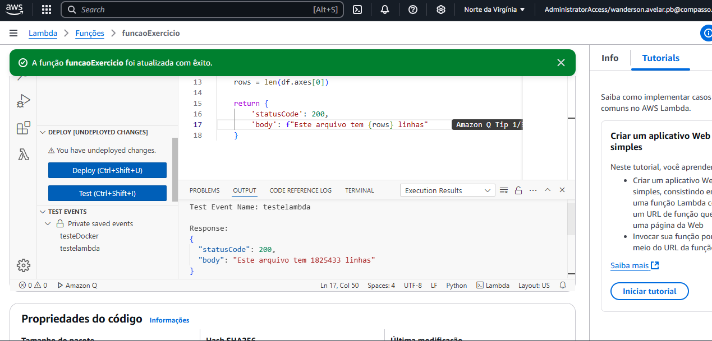

# Lab AWS S3

## Introdução
Este laboratório tem como objetivo explorar as funcionalidades do serviço AWS S3, configurando um bucket para hospedagem de conteúdo estático. Durante as etapas, você aprenderá a criar e configurar um bucket, habilitar a hospedagem de site estático, configurar permissões e políticas de acesso público, e realizar o upload de arquivos para criar um site simples.


## Etapas e Evidências

### 1. Login no Console AWS
Acesse o AWS Management Console por meio do endereço: [academy-compass.awsapps.com/start](https://academy-compass.awsapps.com/start).  

### 2. Criar um Bucket

- Busque pelo serviço **S3** no console.
- Selecione **Create Bucket**.


- Insira o nome do bucket (e.g., `example.com`) e escolha a região **US East (N. Virginia)**.
- Aceite as configurações padrão e crie o bucket. 

Imagem do bucket criado: 


### 3. Habilitar Hospedagem de Site Estático
- Acessar o bucket criado e selecione a aba **Properties**.
- Em **Static website hosting**, habilite a opção **Use this bucket to host a website**.
- Configure o **Index Document**

**Evidência:** 


### Etapa 4: Adicionar política de bucket que torna o conteúdo do bucket publicamente disponível
- Na aba **Permissions**, edite as configurações de **Block public access**.
- Desmarque **Block all public access** e salve as alterações.  
**Evidência:** 


### 5. Etapa 5: Configurar um documento de índice
- Em **Permissions**, adicione a seguinte política para conceder acesso público de leitura:
  ```json
  {
      "Version": "2012-10-17",
      "Statement": [
          {
              "Sid": "PublicReadGetObject",
              "Effect": "Allow",
              "Principal": "*",
              "Action": "s3:GetObject",
              "Resource": "arn:aws:s3:::testecompass.com/*"
          }
      ]
  }


## Fazer upload do documento de indice


## Criar uma pasta chamada dados e, após, faça upload do conteúdo do site (arquivo CSV) para ela.


## Faça upload do conteúdo do site (arquivo CSV) para ela.


### 6. Configurar Documentos de Índice e Erros


## Fazer upload do documento de erros para o bucket


### 7. Testar o Endpoint do Site


### testando o dowload do arquivo dados.csv:


### interface com os 3 objetos criados:


### Exercicio 2- Athena 

# Instruções para Configuração e Consulta de Banco de Dados

## Passo 1: Na guia *Settings* (Configurações), escolha *Manage* (Gerenciar).


---

## Etapa 2: Criar um banco de dados


---

## Etapa 3: Criar uma tabela


---

## Etapa 4: Teste os dados com a seguinte consulta
Substitua o nome dos campos, banco de dados e tabela pelos nomes que você criou anteriormente:
sql
SELECT nome 
FROM nomedobanco.nomedatabela 
WHERE ano = 1999 
ORDER BY total 
LIMIT 15;


## Crie uma consulta que lista os 3 nomes mais usados em cada década desde o 1950 até hoje.


## resultado


# Exercicio 3- lambda 

### Guia para Configuração do AWS Lambda com Layer Personalizada


## Etapa 1: Criar a função do Lambda


## Etapa 2: Construir o código
Construa o código necessário para sua função Lambda.  


### Teste do Lambda
Realize o teste clicando em **Test** e escolha um nome para o teste.  
Ao executar, o erro abaixo deve ser exibido:  



## Etapa 3: Criar uma Layer

### Passo 1: Criar uma pasta e o arquivo Dockerfile
Crie uma nova pasta e, nela, um arquivo chamado **Dockerfile**.  


### Passo 2: Criar a imagem Docker
Use o arquivo **Dockerfile** para gerar a imagem Docker.  


### Passo 3: Acessar o shell do container
Execute o comando para acessar o shell do container Docker.  


### Passo 4: Criar a pasta para bibliotecas
No shell do container, crie uma pasta chamada **python** para armazenar as bibliotecas.  


### Passo 5: Instalar as bibliotecas
Baixe as bibliotecas e suas dependências na pasta **python**.  


### Passo 6: Compactar o diretório python
Compacte todos os arquivos da pasta **python** em um arquivo ZIP.  


### Passo 7: Copiar o ZIP para a máquina local
Abra outro terminal, descubra o ID do container e copie o arquivo ZIP para sua máquina local.  


### Passo 8: Fazer upload para o S3
Faça o upload do arquivo ZIP para um bucket S3.  


### Passo 9: Criar a camada no AWS Lambda
No painel do AWS Lambda, crie uma nova camada, dê o nome **PandasLayer** e use a URL do S3 para fazer o upload.  


---

## Etapa 4: Utilizar a Layer
1. Escolha **Custom Layers** (Camadas personalizadas).

2. Localize a camada e versão criadas.


3. Execute novamente o código utilizando o teste configurado.  



---

## Exemplo de URL no S3
```plaintext
https://s3.us-east-1.amazonaws.com/testecompass.com/minha-camada-pandas.zip

