# Exercicio 3- lambda 

### Guia para Configuração do AWS Lambda com Layer Personalizada


## Etapa 1: Criar a função do Lambda
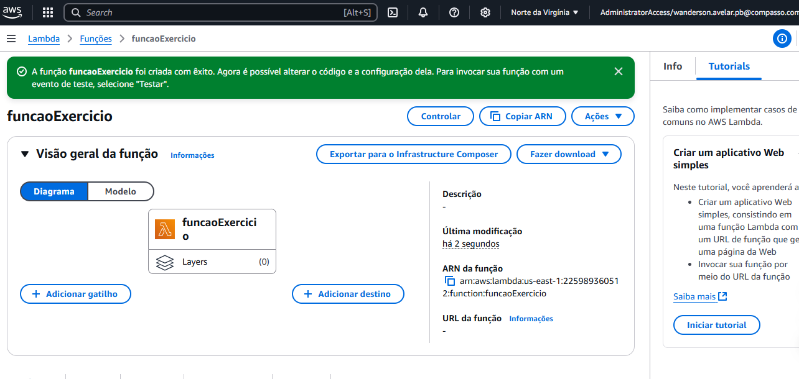


## Etapa 2: Construir o código
Construa o código necessário para sua função Lambda.  
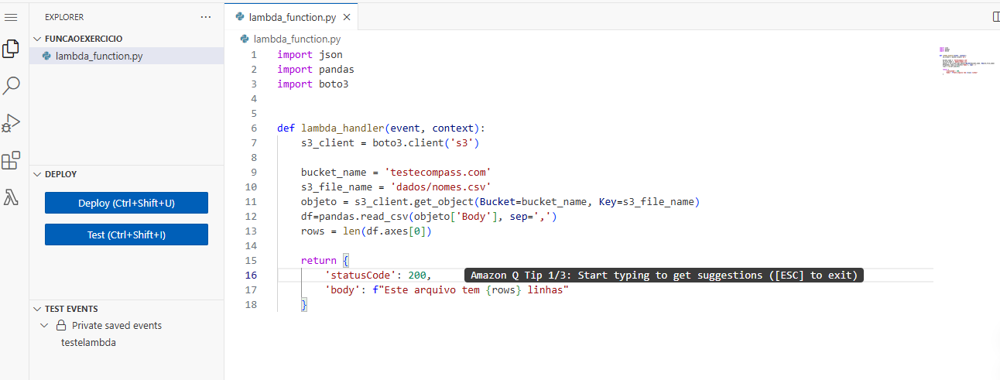

### Teste do Lambda
Realize o teste clicando em **Test** e escolha um nome para o teste.  
Ao executar, o erro abaixo deve ser exibido:  
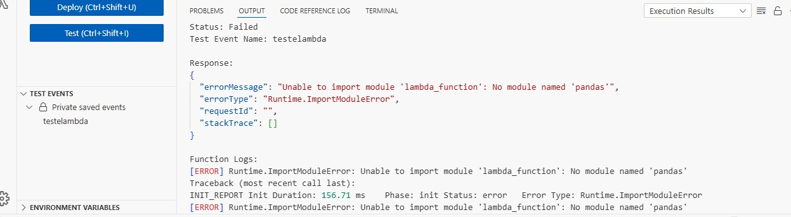


## Etapa 3: Criar uma Layer

### Passo 1: Criar uma pasta e o arquivo Dockerfile
Crie uma nova pasta e, nela, um arquivo chamado **Dockerfile**.  
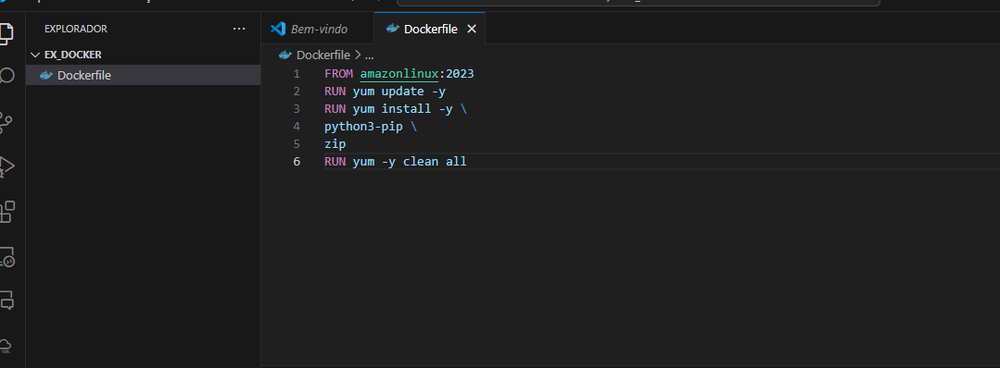

### Passo 2: Criar a imagem Docker
Use o arquivo **Dockerfile** para gerar a imagem Docker.  
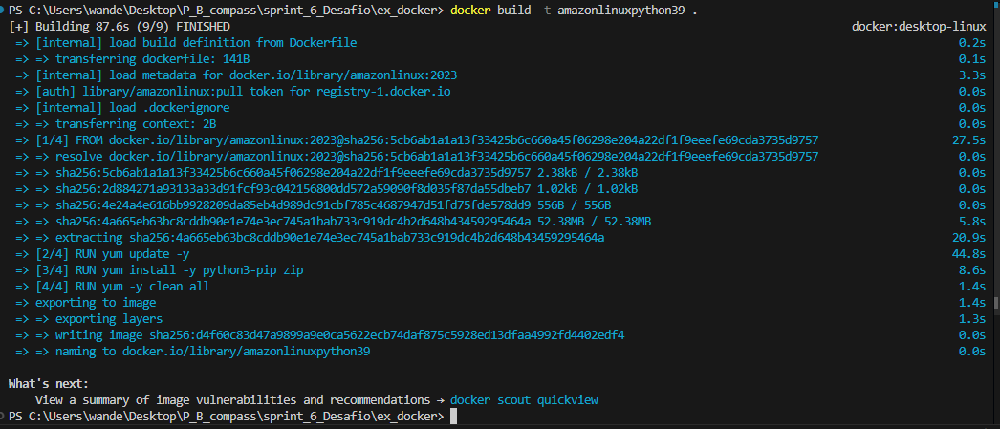

### Passo 3: Acessar o shell do container
Execute o comando para acessar o shell do container Docker.  
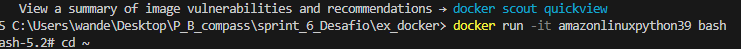

### Passo 4: Criar a pasta para bibliotecas
No shell do container, crie uma pasta chamada **python** para armazenar as bibliotecas.  
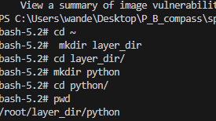

### Passo 5: Instalar as bibliotecas
Baixe as bibliotecas e suas dependências na pasta **python**.  
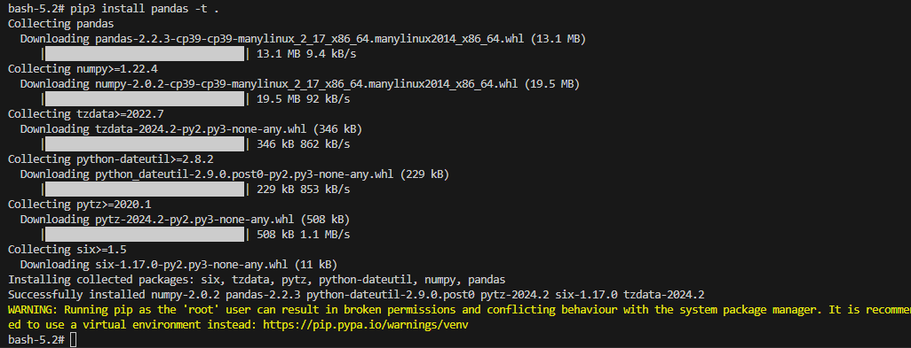

### Passo 6: Compactar o diretório python
Compacte todos os arquivos da pasta **python** em um arquivo ZIP.  
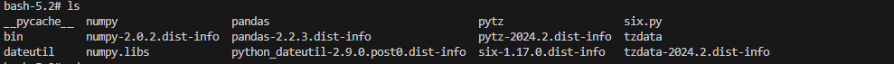

### Passo 7: Copiar o ZIP para a máquina local
Abra outro terminal, descubra o ID do container e copie o arquivo ZIP para sua máquina local.  
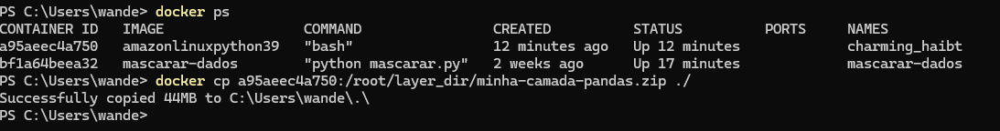

### Passo 8: Fazer upload para o S3
Faça o upload do arquivo ZIP para um bucket S3.  


### Passo 9: Criar a camada no AWS Lambda
No painel do AWS Lambda, crie uma nova camada, dê o nome **PandasLayer** e use a URL do S3 para fazer o upload.  


---

## Etapa 4: Utilizar a Layer
1. Escolha **Custom Layers** (Camadas personalizadas).

2. Localize a camada e versão criadas.


3. Execute novamente o código utilizando o teste configurado.  

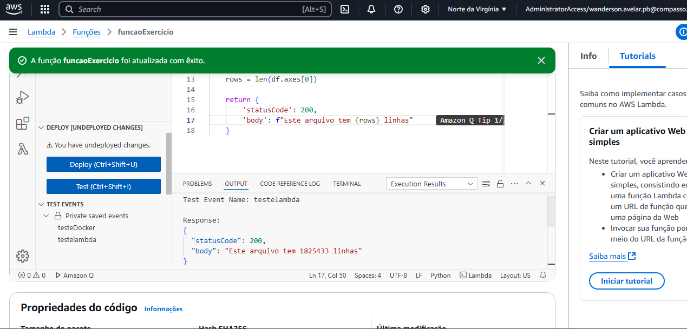

---

## Exemplo de URL no S3
```plaintext
https://s3.us-east-1.amazonaws.com/testecompass.com/minha-camada-pandas.zip

