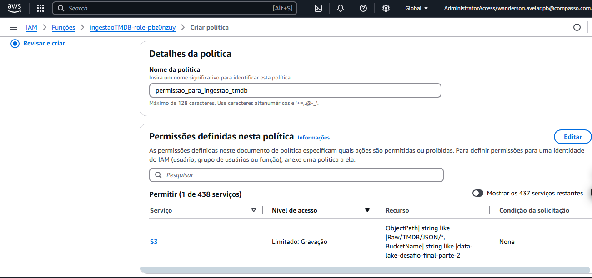
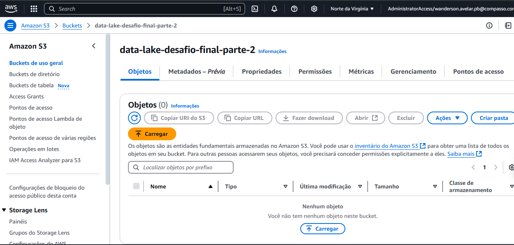
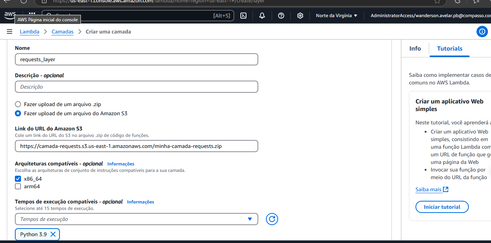
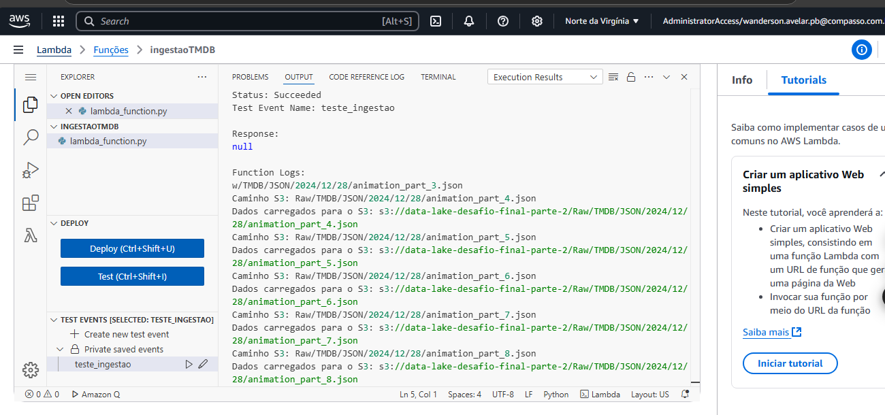
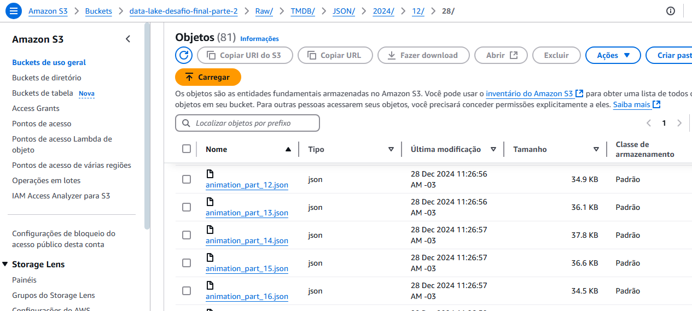
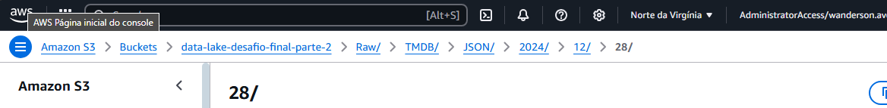

# Desafio AWS: Ingestão de Dados via API para Complementação de Data Lake

## 1. Objetivo

O objetivo desta etapa é combinar conhecimentos adquiridos no programa para realizar a ingestão de dados via APIs, utilizando a AWS Lambda para capturar e persistir informações do TMDB (The Movie Database) no Amazon S3. A prática complementa o Data Lake iniciado na etapa anterior, trazendo novos dados relacionados aos filmes e séries.

## 2. Entregáveis

- **Código Python (.py)**:
  - Implementação da função Lambda para consumo de dados do TMDB.
  - Uso da biblioteca `boto3` para gravação dos dados no Amazon S3.

    confira aqui o codigo: 
    
    [código da função lambda](../desafio/func_lambda.py)

- **Arquivo Markdown**:
  - Documentação das etapas realizadas.
  - Evidências com imagens/prints da execução.
  - Justificativa para o uso de cada API.
  - Questões a serem respondidas com os dados coletados.
- **Camada Lambda**:
  - Configuração de uma camada com bibliotecas necessárias, como `tmdbv3api`. nessa estapa utilizei a biblioteca requests para fazer a requisição para a api do tmdb, confira o arquivo zip da função lambda no repositório: 

  - [arquivo zip da função lambda](../desafio/minha-camada-requests.zip)

- **Evidências**:
  - Prints de configurações no S3, execução da função Lambda e dados carregados.
- **Análise inicial**:
  - Relação entre custo e receita para os 5 melhores e 5 piores filmes dos gêneros comédia e animação.

## 3. Preparação

Antes de iniciar o desafio:
- Certifique-se de compreender o funcionamento do Desafio de Filmes e Séries.
- Configure corretamente o ambiente AWS, incluindo credenciais para acesso ao S3, nessa etapa configuerei as permissoes para a função lambda acessar o bucket do s3 atravez do IAM, confira aqui: 

 

### - Crie um bucket S3 para armazenamento dos dados coletados.

Confira a imagem do bucket s3: 

## 4. Desafio

### 4.1. Ingestão de Dados via API

#### Atividades Realizadas:

1. **Criação da Camada Lambda (Layer)**:
   - Desenvolvi uma camada Lambda contendo as bibliotecas necessárias (`tmdbv3api` e outras dependências).
   - A camada foi carregada na AWS Lambda e vinculada à função.
   

2. **Implementação da Função Lambda**:
   - Desenvolvi o código para:
     - Realizar chamadas à API do TMDB.
     - Capturar dados complementares, incluindo informações financeiras (custo e receita).
     - Agrupar os resultados em arquivos JSON com, no máximo, 100 registros.

3. **Persistência no Amazon S3**:
   - Usei a biblioteca `boto3` para gravar os arquivos JSON no bucket S3.
   - Estrutura do caminho no S3:
     - `s3://data-lake-desafio-final/Raw/TMDB/JSON/<ano>/<mês>/<dia>/<arquivo>.json`

#### Exemplo de Código:
Veja aqui o [código Lambda implementado](../desafio/func_lambda.py).

# 4. **Análise dos Dados**:
   - A ingestão de dados foi configurada para capturar informações financeiras e popularidade dos filmes dos gêneros comédia e animação.
   ### - Questões a serem respondidas:
     - Qual a relação de custo e receita entre os 5 melhores e os 5 piores filmes dos gêneros comédia e animação?
     - Esses dados interferem na popularidade dos filmes?

### Evidências:

1. **Execução da Função Lambda**:
   

2. **Arquivos JSON no S3**:
   

3. **Estrutura de Diretórios no S3**:
   - Exemplo de estrutura:
     - `s3://data-lake-desafio-final/Raw/TMDB/JSON/2024/12/28/comedy_part_1.json`

   

## 5. Conclusão

Nesta etapa do desafio, foi possível:
- Capturar e integrar dados externos ao Data Lake.
- Consolidar conhecimentos de AWS Lambda, API e S3.
- Estruturar os dados de forma organizada para futuras análises.

O trabalho reforçou a importância de boas práticas na ingestão de dados e na automação de processos, além de abrir caminho para análises mais aprofundadas nas próximas etapas do projeto.
