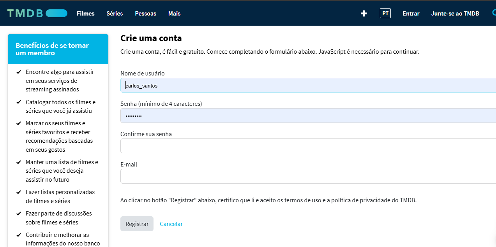
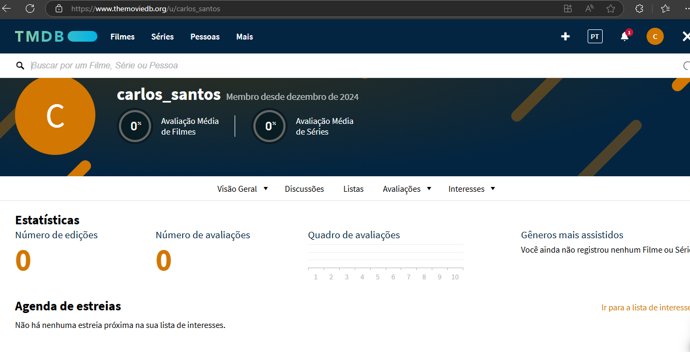
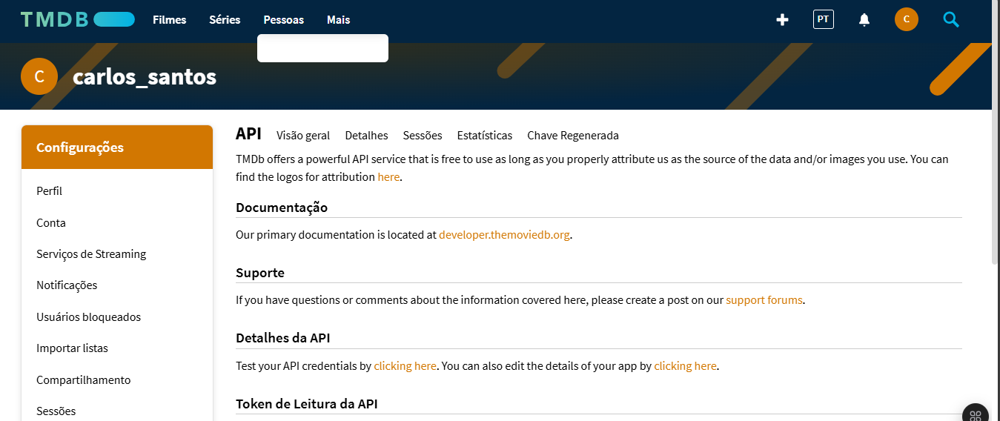
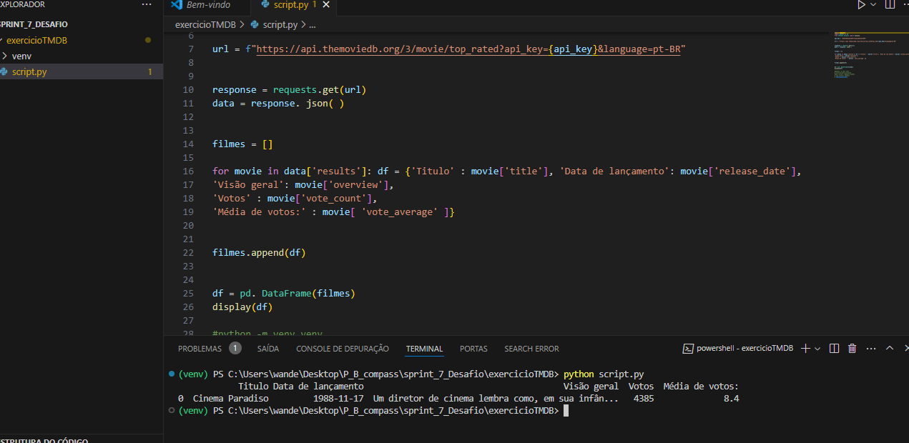

# Exercício: Criação de Conta e API no TMDB

## Introdução

Este exercício tem como objetivo configurar uma conta no TMDB, criar uma API para consumo de dados e testar as credenciais geradas.

## Etapas Realizadas

### 1. Criação da Conta no TMDB
- Foi realizada a criação de uma conta no TMDB para acesso aos recursos da plataforma.

### 2. Perfil Criado
- Após a criação, o perfil foi configurado com sucesso.

### 3. Criação da API
- Uma API foi gerada para possibilitar chamadas aos serviços do TMDB.

### 4. Teste de Credenciais
- As credenciais da API foram testadas com sucesso, confirmando seu funcionamento.

## Conclusão

A configuração da conta, criação da API e validação das credenciais foram realizadas com sucesso, garantindo acesso aos dados do TMDB para os próximos desafios.
