# Exercício: Configuração e Execução do AWS Glue e Lake Formation

Este repositório contém as etapas e evidências relacionadas ao exercício de configuração de permissões, criação de roles, jobs e crawlers no AWS Glue e Lake Formation. As imagens de suporte estão localizadas na pasta `exercicios\evidencias_exercicios\` e são referenciadas ao longo do documento.

## Etapas do Exercício

### 1. Criando a IAM Role para os jobs do AWS Glue
A criação da IAM Role é o primeiro passo, como mostrado abaixo:

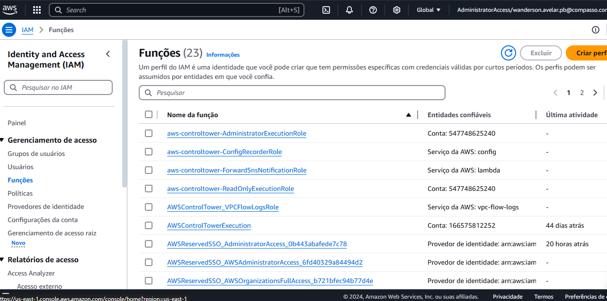

### 2. Adicionando Permissões
Na etapa **Add permissions**, foi selecionada a permissão **AmazonS3FullAccess**:

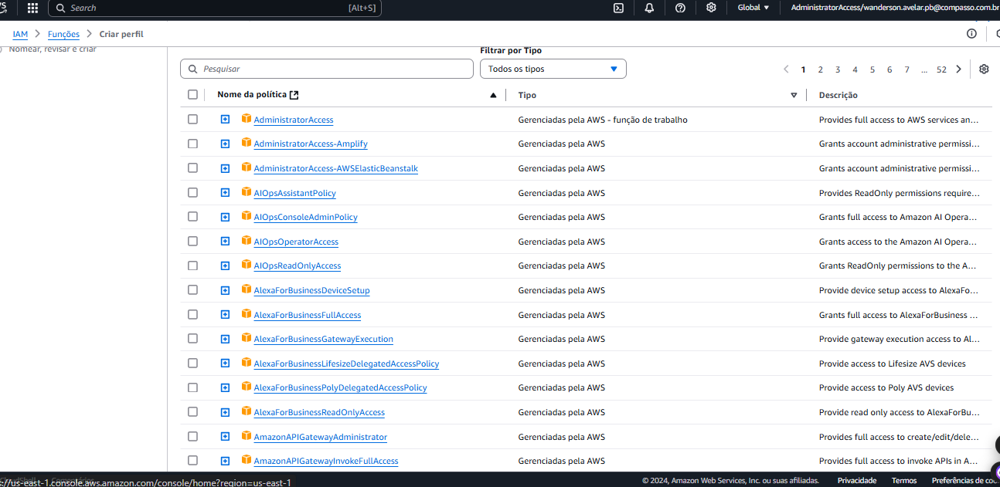

### 3. Finalizando a Criação da Role
Informe o nome da role como `AWSGlueServiceRole-Lab4` e clique em **Create Role**:

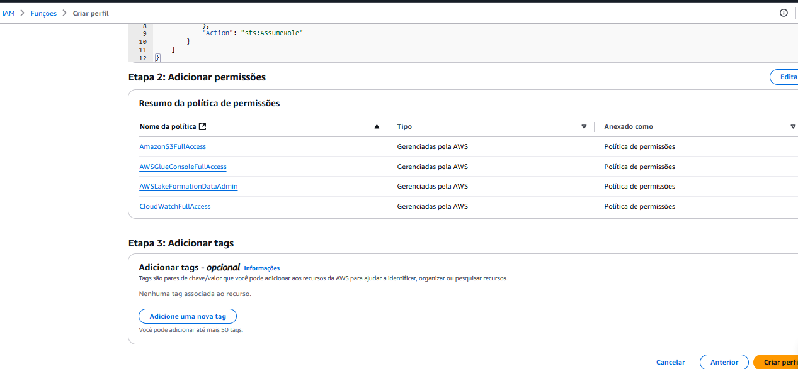

### 4. Perfil Criado
Visualize o perfil criado conforme a imagem abaixo:

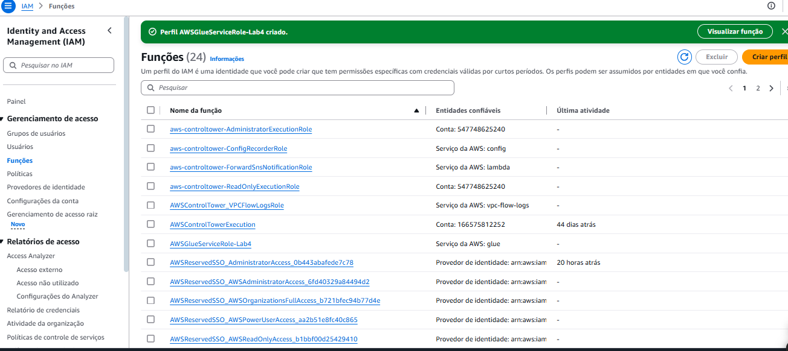

### 5. Configurando o AWS Glue
Para configurar o AWS Glue, siga os passos abaixo:

1. Indique as roles que terão acesso ao serviço AWS Glue, selecionando a role `AWSGlueServiceRole-Lab4` em **Choose roles**:

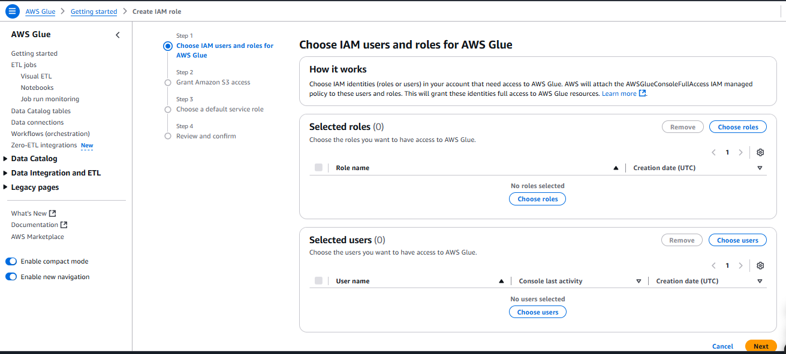

2. No próximo passo, forneça acesso total ao S3 para leitura e escrita:

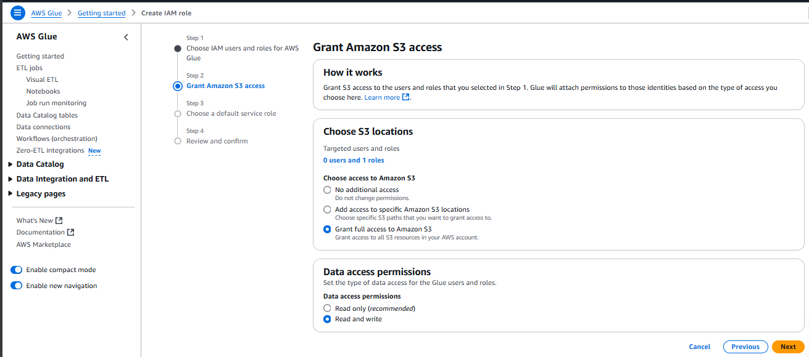

3. Marque a opção **Update the standard AWS Glue service role and set it as the default (recommended)** e finalize o processo clicando em **Next** e depois **Apply changes**:

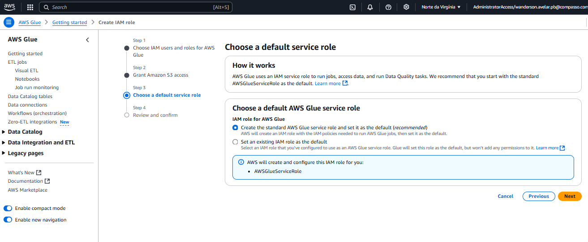

### 6. Configurando o AWS Lake Formation
Acesse o AWS Lake Formation e, no menu **Databases**, clique em **Create Database**:

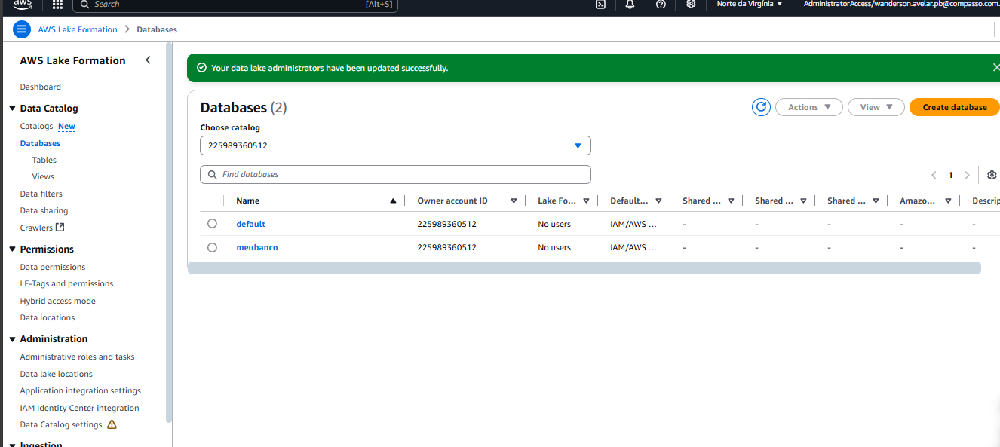

#### Database Criado
Veja o resultado da criação do database:

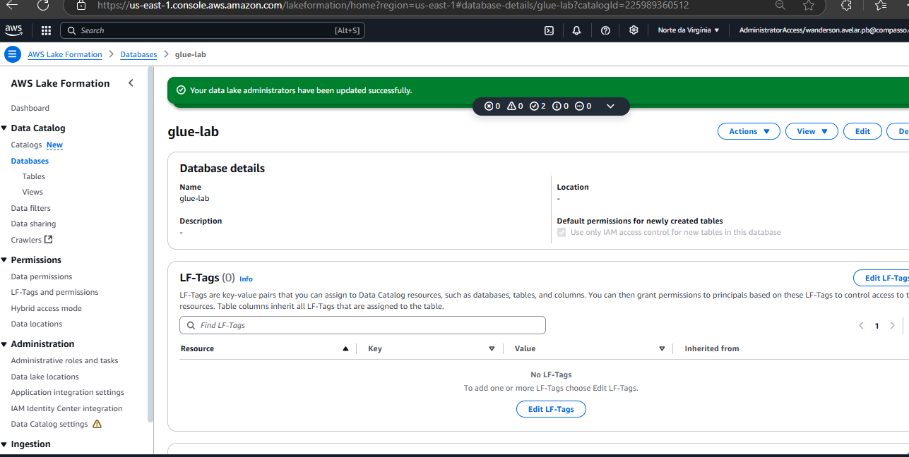

### 7. Criando Novo Job no AWS Glue
1. Na página inicial, busque por **Visual ETL** em **ETL jobs** e clique em **Script editor**:

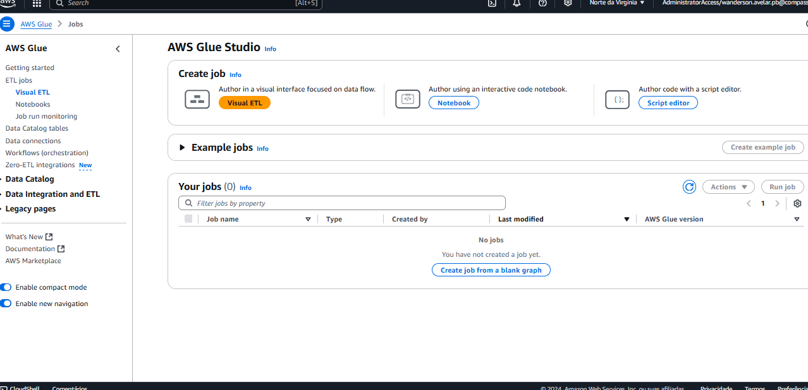

2. Crie o script conforme necessário:

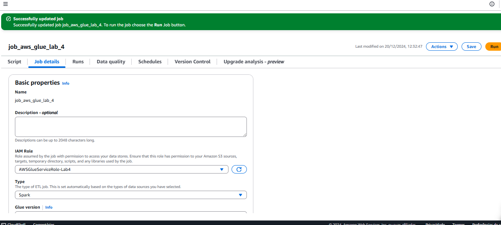

#### Exemplo de Script
Veja um exemplo de script criado:

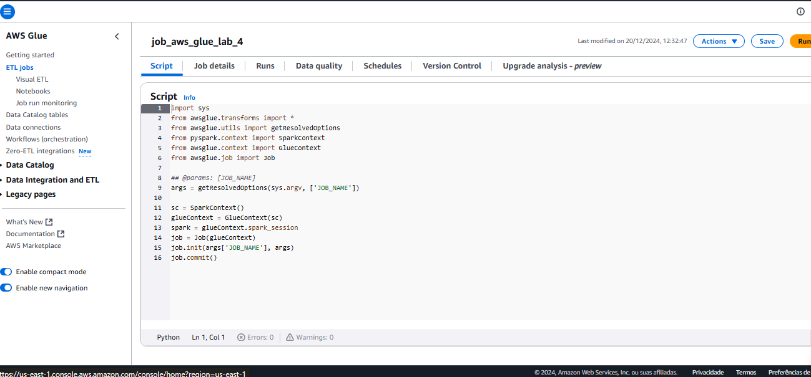

#### Parar Execuções Ativas
Para evitar conflitos, interrompa os jobs em execução:

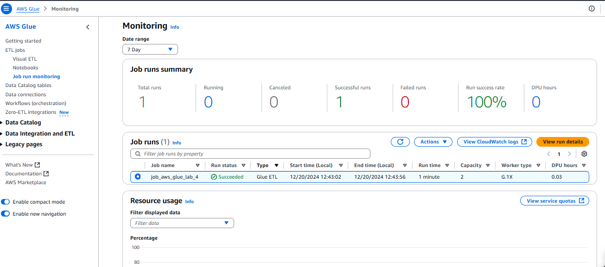

#### Resultado
Construa o job nos moldes descritos e veja o resultado:

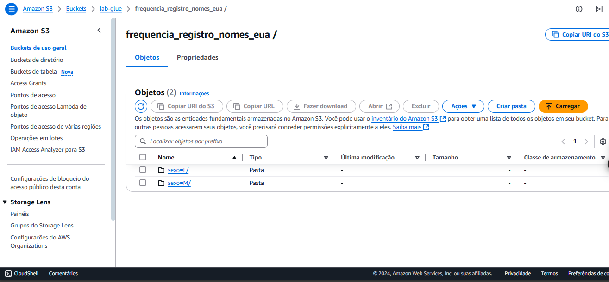

#### Logs de Execução
Verifique os logs no CloudWatch:

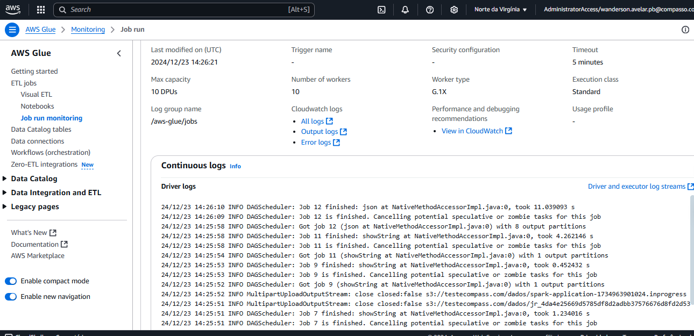

### 8. Criando Crawler
1. Na tela inicial, selecione o **FrequenciaRegistroNomesCrawler** e clique em **Run**:

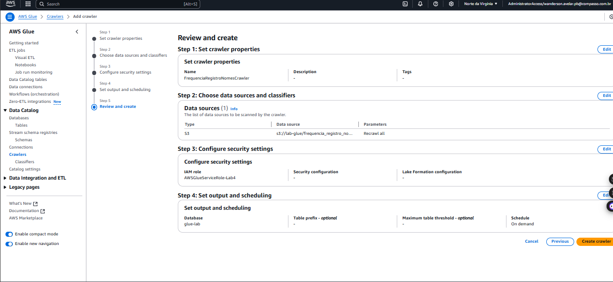

### 9. Usando o Athena
Abra o Athena com o comando SQL gerado e certifique-se de que esteja configurado conforme a imagem abaixo:

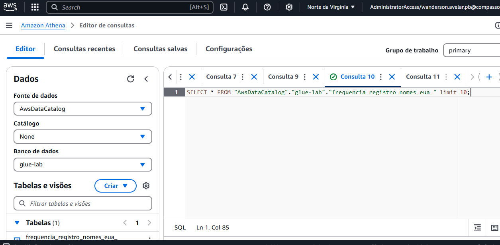

#### Tabela Gerada
Veja a tabela resultante:

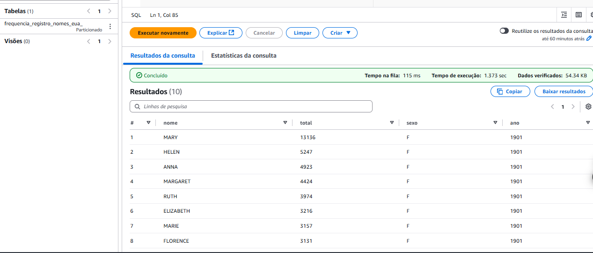

