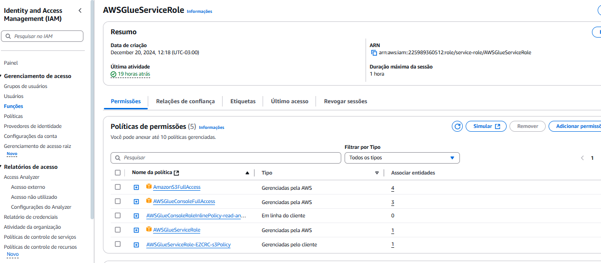
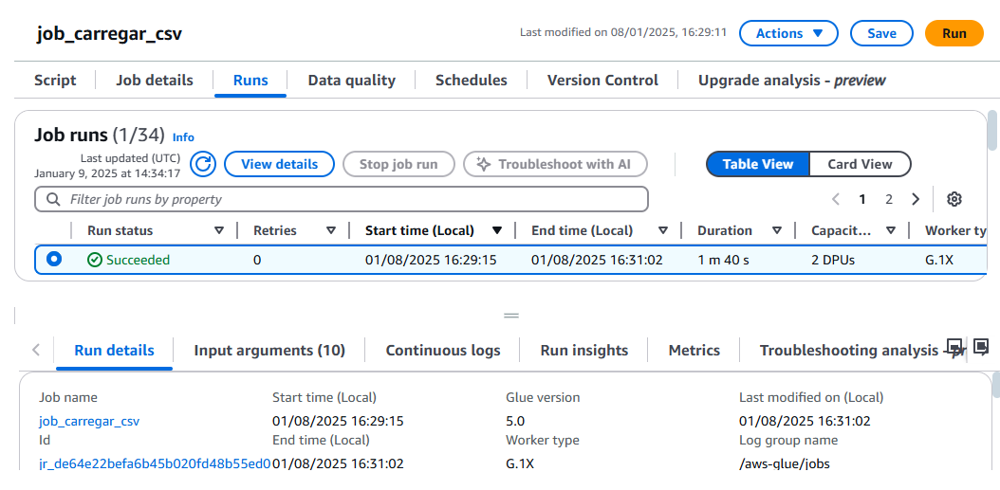
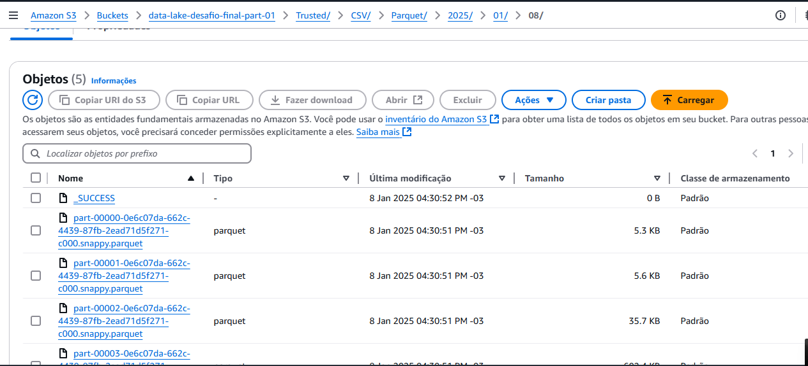
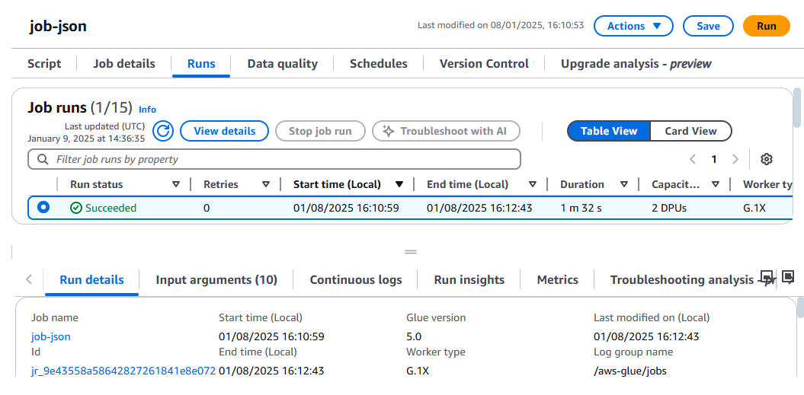
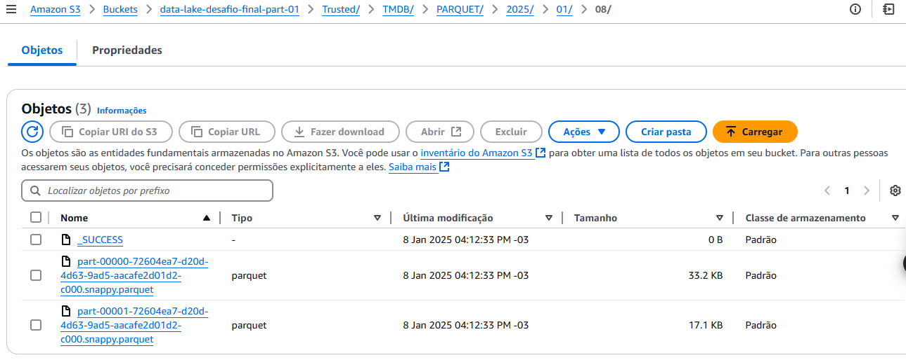
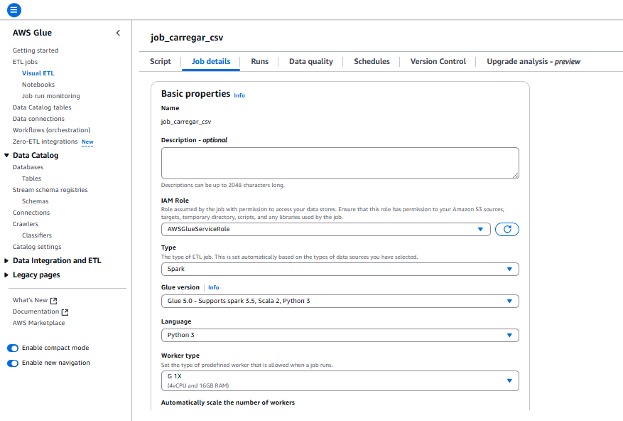
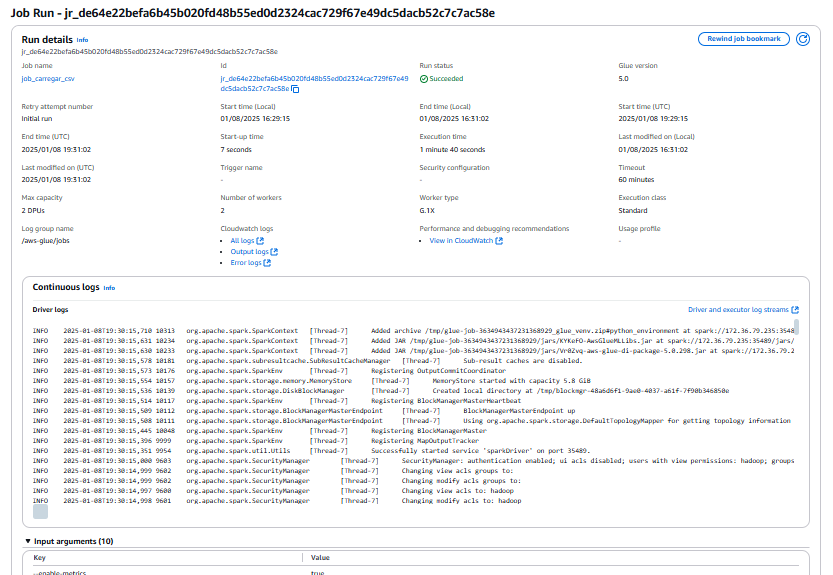

# Desafio AWS: Processamento Camada Trusted no Data Lake

## 1. Objetivo

Nesta etapa do desafio, o grande objetivo é trazer os dados armazenados na Raw Zone para a Trusted Zone, garantindo que eles estejam limpos, padronizados e prontos para análises avançadas no AWS Athena. Essa prática não apenas consolida os conhecimentos adquiridos durante o programa, mas também simula um cenário real de trabalho com Data Lakes.

## 2. Entregáveis

- **Código Python (.py):**
  - Dois scripts Spark para o AWS Glue:
    - Job 1: Processamento de arquivos CSV da camada Raw.
    - Job 2: Processamento de dados JSON provenientes da API TMDB.
  - Os códigos incluem comentários detalhados, explicando cada etapa do processamento.

  Acesse os códigos:
  - [Job 1: Código AWS Glue para CSV](../desafio/job_csv.py)
  - [Job 2: Código AWS Glue para JSON](../desafio/job_json.py)

- **Arquivo Markdown:**
  - Documentação completa do desafio.
  - Explicações sobre o uso das APIs.
  - Questões a serem respondidas na última etapa.

- **Evidências:**
  - Capturas de tela das configurações do Glue.
  - Prints do Data Catalog e dos dados armazenados no S3.
  - Logs de execução para validação dos resultados.

## 3. Preparação

Antes de começar, tirei um tempo para revisar o Desafio de Filmes e Séries (detalhado na Sprint 6) e garantir que o ambiente AWS estava devidamente configurado. Além disso, certifiquei-me de que as permissões necessárias no IAM estavam ajustadas para o Glue, o S3 e o Athena.

## 4. Desafio

### 4.1. Entrega 3: Processamento Camada Trusted

A Trusted Zone é onde os dados finalmente começam a fazer sentido. A ideia é pegar as informações brutas da Raw Zone e transformá-las em algo confiável e utilizável, usando o **AWS Glue** com **Apache Spark**.

#### Etapas realizadas:

1. # **Processamento de arquivos CSV (Job 1):**
   - Origem: Dados CSV da Raw Zone.
   - Transformação: Limpeza e conversão para o formato PARQUET.
   - Persistência e estrutura: Dados armazenados na Trusted Zone sem particionamento.
   - **Evidência:**
   # **job execultao com sucesso**
     

   ### **Persistencia dos dados no s3**
     

2. # **Processamento de dados JSON (Job 2):**
   - Origem: Dados JSON oriundos da API TMDB.
   - Transformação: Limpeza, padronização e conversão para o formato PARQUET.
   - Persistência e estrutura: Dados armazenados no S3, particionados por ano, mês e dia.
   - **Evidência:**
   ### **job execultao com sucesso**
     

   ### **Persistencia dos dados no s3**
     

### Configurações dos Jobs no AWS Glue:

Para garantir eficiência e otimização de custos, configurei os jobs no Glue com as seguintes opções:

- **Worker type:** G 1x (opção de menor configuração).
- **Requested number of workers:** 2 (quantidade mínima).
- **Job timeout (minutes):** 60 (ou menos, dependendo do tamanho dos dados).

# Logs de Execução

Além das configurações, verifiquei os logs de execução para garantir que tudo estava funcionando conforme o esperado.

- **Evidência dos Logs:**
  

## 5. Conclusão

Realizar esse desafio foi uma experiência enriquecedora. Cada etapa trouxe um aprendizado único, desde a configuração dos serviços AWS até o processamento efetivo dos dados.

- Consolidamos os dados na Trusted Zone em formato PARQUET.
- Tornamos os dados acessíveis via Athena para análises futuras.
- Aprendi a importância de organizar e particionar os dados de forma eficiente.

Além disso, esse desafio reforçou a importância de planejar cada detalhe do pipeline, desde as permissões no IAM até a verificação final dos dados no S3. Estou animado para continuar explorando e aprendendo mais sobre Data Lakes e serviços AWS!
