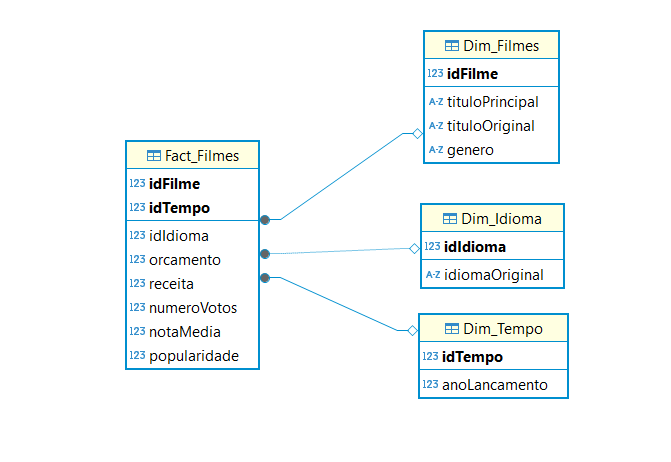
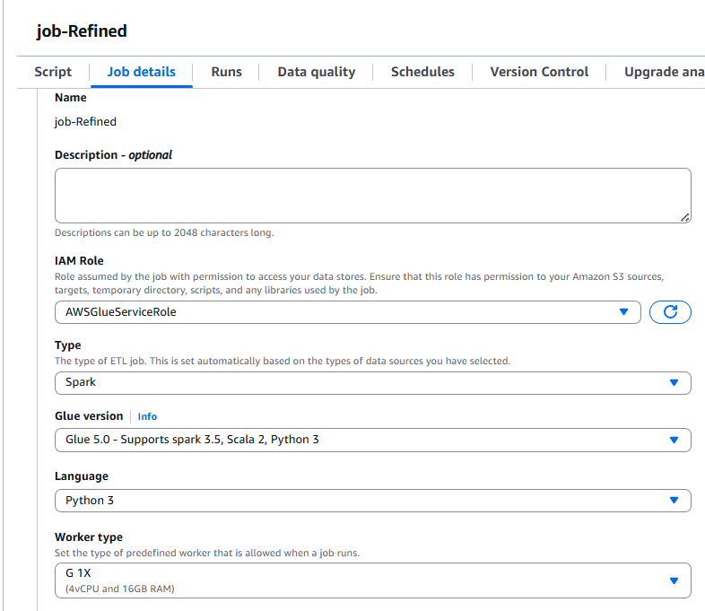
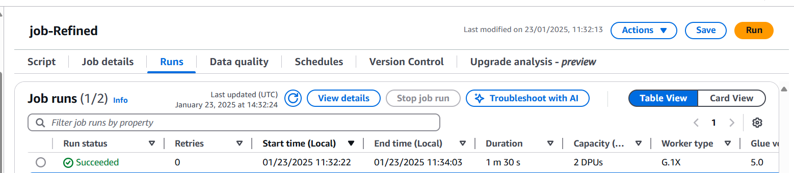
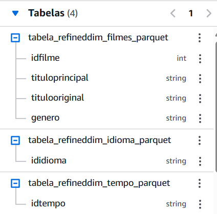
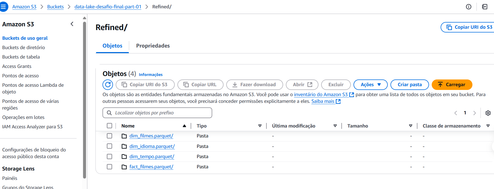

# Desafio AWS: Modelagem de Dados na Camada Refined- Sprint9

## 1. Objetivo

O objetivo deste desafio é aplicar os conceitos aprendidos ao longo do programa, consolidando conhecimentos de modelagem de dados multidimensional, processamento ETL e estruturação de dados para visualização no QuickSight. A meta é estruturar os dados da Trusted Zone para a Refined Zone, garantindo que estejam otimizados para análise e extração de insights.

## 2. Entregáveis

- **Código Python (.py):**
  - Script Spark para o AWS Glue, processando os dados da Trusted Zone para a Refined Zone.

   [Job 1: Código AWS Glue trusted para refined](../desafio/job_refined.py)

- **Modelo de Dados:**
  - Representação da camada Refined, baseada na modelagem multidimensional.
- **Arquivo Markdown:**
  - Documentação detalhada das etapas realizadas no desafio.
  - Evidências (prints e imagens).
- **Evidências:**
  - Logs de execução, prints das configurações do AWS Glue e dos dados processados no S3.

## 4. Desafio

### 4.1. Modelagem de Dados

O modelo multidimensional foi desenvolvido com foco em consultas analíticas. A estruturação da camada Refined seguiu os seguintes princípios:

- **Tabela Fato:** Contendo métricas agregáveis, como receita, número de votos e popularidade.
- **Dimensões:** Organizadas para facilitar a análise por diferentes perspectivas (tempo, idioma e filmes).

#### Modelo:
- **Fato:** Fact_Filmes
- **Dimensões:** Dim_Tempo, Dim_Idioma, Dim_Filmes

### 4.2. Processamento Camada Refined

#### Job AWS Glue

- **Origem:** Dados da Trusted Zone.
- **Transformação:** Limpeza, padronização e conversão para formato PARQUET.
- **Persistência:** Dados armazenados na Refined Zone.

#### Configurações do Job:

- **Worker type:** G 1x
- **Requested number of workers:** 2
- **Job timeout:** 60 minutos

#### Logs de Execução com mensagem de sucesso:

### 4.3. Resultados

Os dados processados foram armazenados no S3, otimizados para consultas no Athena e visualização no QuickSight.

### Veja as tabelas dispostas no athena para que possam ser feitas consultas posteriores:

#### Persistência dos Dados no S3:

- **Camada Refined (PARQUET):**

## 5. Conclusão

A realização deste desafio consolidou conhecimentos importantes sobre o processamento de dados no AWS, desde a configuração de permissões até a modelagem e transformação de dados.

- Estruturamos a camada Refined com base na modelagem multidimensional.
- Processamos dados brutos para um formato otimizado.
- Preparámos os dados para visualização no QuickSight, garantindo um pipeline eficiente.

A experiência reforçou a importância de boas práticas no gerenciamento de Data Lakes e uso de ferramentas AWS.
